# 事故再現 動画プロンプト集 video_prompts_v16

イベント設営現場 想定事故事例集（全15事例）｜株式会社 博展 御中

監修：金田 義太（労働安全コンサルタント 登録第4840号）　／　作成日：2026年6月15日

> 各事例の採用ベース画像＋リアル化画像（base / OpenAI / Google）を開始フレームに用いる **image-to-video** 前提のプロンプト集です。
> 1事例につき〔前 → 事故の瞬間 → 後〕の3フェーズを、**OpenAI Sora 2** 用と **Google Veo 3.1** 用の2種、**日本語・英語併記**で掲載します。
> 約8秒・日本の会場・PPE着用・実在ロゴなし・**流血/残虐表現なし**・「安全教育用の再現」という文脈を各プロンプトに明記しています（生成フィルタ配慮）。
> ※本映像は生成AIによる創作（再現）であり、特定の事故・人物・企業を示すものではありません。

---

## 事故事例 N01　展示パネル積み下ろし中、昇降板からの墜落

- カテゴリ：TGL（トラックのテールゲートリフター（昇降板／パワーゲート））
- 開始フレーム画像：`photos_v16/N01/base.png` ／ `openai.png` ／ `google.png`（3案いずれかを開始/キーフレームに使用）
- 監修：金田 義太（労働安全コンサルタント 登録第4840号）

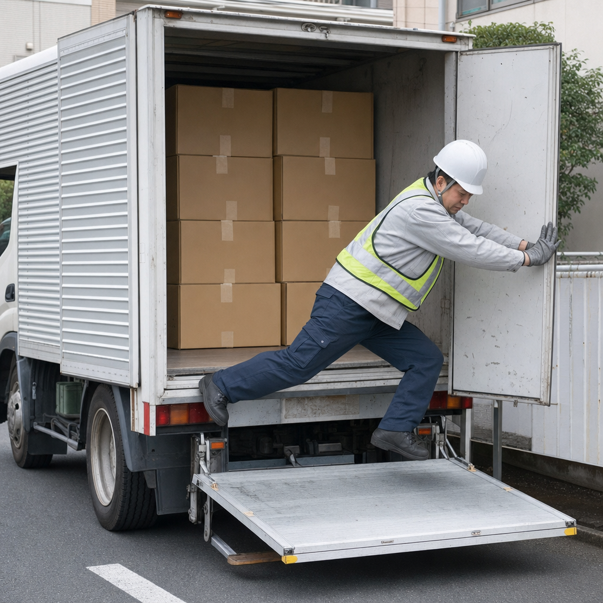
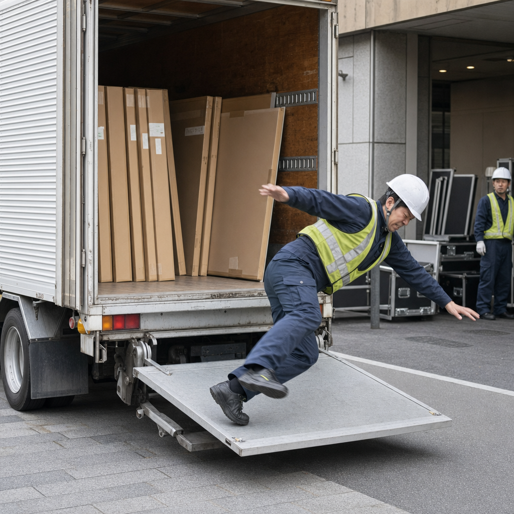
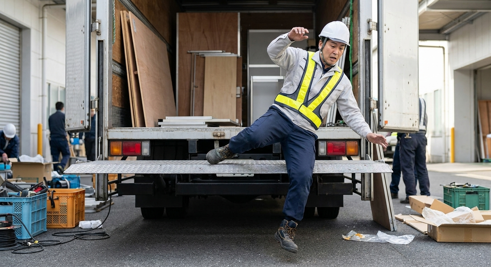

### 前（事故直前） / Phase 1 — Before (lead-up)

**OpenAI Sora 2**

- 【Sora 2／日本語】この画像を開始フレームとして動かす（image-to-video）。ドキュメンタリー調・自然光・手持ちカメラのリアルな実写映像。場面：前（事故直前）。展示会場の搬入口。トラックのテールゲートリフター（昇降板）で展示パネル・什器を積み下ろししている。作業員は通常どおり準備・作業を進めており、まだ異常は起きていない平穏な場面。 舞台は日本の展示会・イベント設営会場、登場人物は日本人作業員、トラックのテールゲートリフター（昇降板／パワーゲート）を使用。服装・保護具はあごひも付きヘルメット・ハイビズ（高視認性ベスト）・安全靴。実在ロゴや可読文字は映さない。これは安全教育用の事故再現映像であり、流血・残虐・苦痛の誇張は描かない。約8秒・16:9。
- [Sora 2 / English] Use the provided image as the starting keyframe (image-to-video). Photorealistic documentary footage, natural light, handheld camera. Scene: Phase 1 — Before (lead-up). unloading exhibition panels and display fixtures from a truck tail-gate lifter at an event hall loading bay; workers proceed with the build-up task normally — a calm moment, no incident yet. Set at a Japanese exhibition / event build-up venue with Japanese workers using a truck tail-gate lifter / power-gate (rear lift platform). Workers wear hard hat with chin strap, hi-vis vest, safety boots. No real logos or readable text. This is a safety-education re-enactment; no blood, gore or exaggerated suffering. About 8 seconds, 16:9.

**Google Veo 3.1**

- 【Veo 3.1／日本語】開始キーフレーム＝この画像（image-to-video）。被写体：あごひも付きヘルメット・ハイビズ（高視認性ベスト）・安全靴を着けた日本人作業員とトラックのテールゲートリフター（昇降板／パワーゲート）。場面：前（事故直前）。アクション：展示会場の搬入口。トラックのテールゲートリフター（昇降板）で展示パネル・什器を積み下ろししている。作業員は通常どおり準備・作業を進めており、まだ異常は起きていない平穏な場面。 カメラ：ゆっくりとした寄り（緩やかなプッシュイン）／手持ちの微振動。ライティング：会場内の自然な照明。スタイル：リアルなドキュメンタリー写真調、実在ロゴ・可読文字なし。安全教育用の再現であり流血・残虐表現は含めない。約8秒・16:9。
- [Veo 3.1 / English] First keyframe = the provided image (image-to-video). Subject: Japanese workers in hard hat with chin strap, hi-vis vest, safety boots with a truck tail-gate lifter / power-gate (rear lift platform). Scene: Phase 1 — Before (lead-up). Action: unloading exhibition panels and display fixtures from a truck tail-gate lifter at an event hall loading bay; workers proceed with the build-up task normally — a calm moment, no incident yet. Camera: slow push-in with slight handheld motion. Lighting: natural indoor venue light. Style: realistic documentary photography, no real logos or readable text. A safety-education re-enactment with no blood or gore. About 8 seconds, 16:9.

### 事故の瞬間 / Phase 2 — The moment

**OpenAI Sora 2**

- 【Sora 2／日本語】この画像を開始フレームとして動かす（image-to-video）。ドキュメンタリー調・自然光・手持ちカメラのリアルな実写映像。場面：事故の瞬間。荷台から降りようとした作業員が、昇降板が荷台の高さまで上がり切っていない段差に気づかずバランスを崩し、地面側へ墜落する瞬間。危険の一瞬を捉える（流血・残虐表現なし）。 舞台は日本の展示会・イベント設営会場、登場人物は日本人作業員、トラックのテールゲートリフター（昇降板／パワーゲート）を使用。服装・保護具はあごひも付きヘルメット・ハイビズ（高視認性ベスト）・安全靴。実在ロゴや可読文字は映さない。これは安全教育用の事故再現映像であり、流血・残虐・苦痛の誇張は描かない。約8秒・16:9。
- [Sora 2 / English] Use the provided image as the starting keyframe (image-to-video). Photorealistic documentary footage, natural light, handheld camera. Scene: Phase 2 — The moment. a worker stepping off the truck bed misjudges the gap/step to the lift platform, loses balance and falls toward the ground — capture the dangerous instant (no blood, no gore). Set at a Japanese exhibition / event build-up venue with Japanese workers using a truck tail-gate lifter / power-gate (rear lift platform). Workers wear hard hat with chin strap, hi-vis vest, safety boots. No real logos or readable text. This is a safety-education re-enactment; no blood, gore or exaggerated suffering. About 8 seconds, 16:9.

**Google Veo 3.1**

- 【Veo 3.1／日本語】開始キーフレーム＝この画像（image-to-video）。被写体：あごひも付きヘルメット・ハイビズ（高視認性ベスト）・安全靴を着けた日本人作業員とトラックのテールゲートリフター（昇降板／パワーゲート）。場面：事故の瞬間。アクション：荷台から降りようとした作業員が、昇降板が荷台の高さまで上がり切っていない段差に気づかずバランスを崩し、地面側へ墜落する瞬間。危険の一瞬を捉える（流血・残虐表現なし）。 カメラ：ゆっくりとした寄り（緩やかなプッシュイン）／手持ちの微振動。ライティング：会場内の自然な照明。スタイル：リアルなドキュメンタリー写真調、実在ロゴ・可読文字なし。安全教育用の再現であり流血・残虐表現は含めない。約8秒・16:9。
- [Veo 3.1 / English] First keyframe = the provided image (image-to-video). Subject: Japanese workers in hard hat with chin strap, hi-vis vest, safety boots with a truck tail-gate lifter / power-gate (rear lift platform). Scene: Phase 2 — The moment. Action: a worker stepping off the truck bed misjudges the gap/step to the lift platform, loses balance and falls toward the ground — capture the dangerous instant (no blood, no gore). Camera: slow push-in with slight handheld motion. Lighting: natural indoor venue light. Style: realistic documentary photography, no real logos or readable text. A safety-education re-enactment with no blood or gore. About 8 seconds, 16:9.

### 後（直後の対応） / Phase 3 — After (response)

**OpenAI Sora 2**

- 【Sora 2／日本語】この画像を開始フレームとして動かす（image-to-video）。ドキュメンタリー調・自然光・手持ちカメラのリアルな実写映像。場面：後（直後の対応）。直ちに作業を中断し、周囲の作業員が駆け寄って安全を確認する。大きな外傷描写はなく、再発防止を促す静かな余韻で終える。 舞台は日本の展示会・イベント設営会場、登場人物は日本人作業員、トラックのテールゲートリフター（昇降板／パワーゲート）を使用。服装・保護具はあごひも付きヘルメット・ハイビズ（高視認性ベスト）・安全靴。実在ロゴや可読文字は映さない。これは安全教育用の事故再現映像であり、流血・残虐・苦痛の誇張は描かない。約8秒・16:9。
- [Sora 2 / English] Use the provided image as the starting keyframe (image-to-video). Photorealistic documentary footage, natural light, handheld camera. Scene: Phase 3 — After (response). work stops immediately; nearby workers rush in and check on safety. No graphic injury; end on a quiet beat that stresses prevention. Set at a Japanese exhibition / event build-up venue with Japanese workers using a truck tail-gate lifter / power-gate (rear lift platform). Workers wear hard hat with chin strap, hi-vis vest, safety boots. No real logos or readable text. This is a safety-education re-enactment; no blood, gore or exaggerated suffering. About 8 seconds, 16:9.

**Google Veo 3.1**

- 【Veo 3.1／日本語】開始キーフレーム＝この画像（image-to-video）。被写体：あごひも付きヘルメット・ハイビズ（高視認性ベスト）・安全靴を着けた日本人作業員とトラックのテールゲートリフター（昇降板／パワーゲート）。場面：後（直後の対応）。アクション：直ちに作業を中断し、周囲の作業員が駆け寄って安全を確認する。大きな外傷描写はなく、再発防止を促す静かな余韻で終える。 カメラ：ゆっくりとした寄り（緩やかなプッシュイン）／手持ちの微振動。ライティング：会場内の自然な照明。スタイル：リアルなドキュメンタリー写真調、実在ロゴ・可読文字なし。安全教育用の再現であり流血・残虐表現は含めない。約8秒・16:9。
- [Veo 3.1 / English] First keyframe = the provided image (image-to-video). Subject: Japanese workers in hard hat with chin strap, hi-vis vest, safety boots with a truck tail-gate lifter / power-gate (rear lift platform). Scene: Phase 3 — After (response). Action: work stops immediately; nearby workers rush in and check on safety. No graphic injury; end on a quiet beat that stresses prevention. Camera: slow push-in with slight handheld motion. Lighting: natural indoor venue light. Style: realistic documentary photography, no real logos or readable text. A safety-education re-enactment with no blood or gore. About 8 seconds, 16:9.

---

## 事故事例 N02　什器の積み下ろし中、昇降板と車体の間に足を挟まれ

- カテゴリ：TGL（トラックのテールゲートリフター（昇降板／パワーゲート））
- 開始フレーム画像：`photos_v16/N02/base.png` ／ `openai.png` ／ `google.png`（3案いずれかを開始/キーフレームに使用）
- 監修：金田 義太（労働安全コンサルタント 登録第4840号）

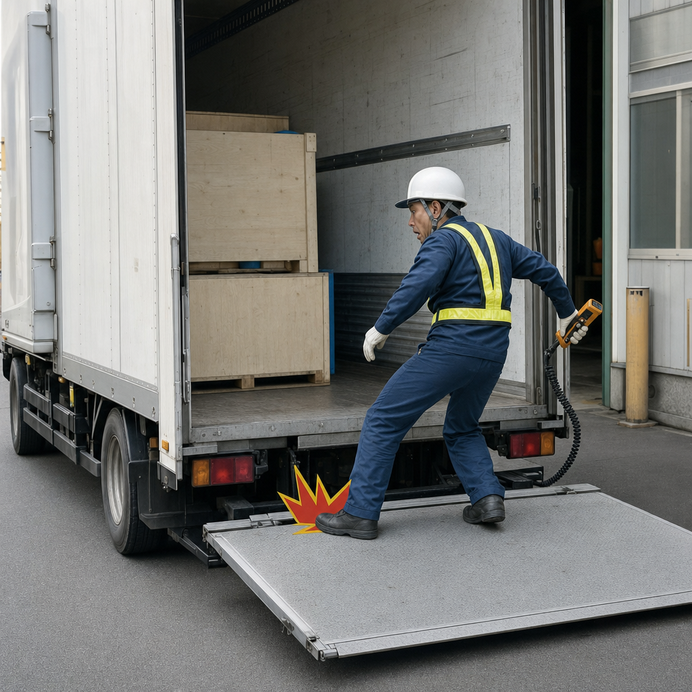
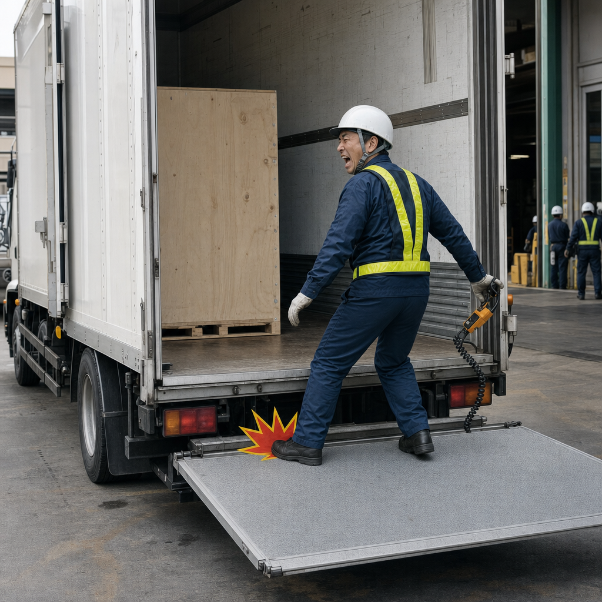
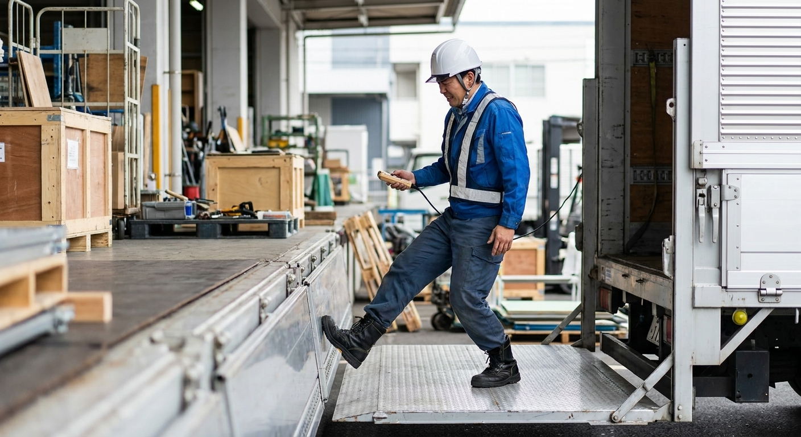

### 前（事故直前） / Phase 1 — Before (lead-up)

**OpenAI Sora 2**

- 【Sora 2／日本語】この画像を開始フレームとして動かす（image-to-video）。ドキュメンタリー調・自然光・手持ちカメラのリアルな実写映像。場面：前（事故直前）。会場搬入口。昇降板の上に立ち、什器の積み下ろしのため昇降板を操作している。作業員は通常どおり準備・作業を進めており、まだ異常は起きていない平穏な場面。 舞台は日本の展示会・イベント設営会場、登場人物は日本人作業員、トラックのテールゲートリフター（昇降板／パワーゲート）を使用。服装・保護具はあごひも付きヘルメット・ハイビズ（高視認性ベスト）・安全靴。実在ロゴや可読文字は映さない。これは安全教育用の事故再現映像であり、流血・残虐・苦痛の誇張は描かない。約8秒・16:9。
- [Sora 2 / English] Use the provided image as the starting keyframe (image-to-video). Photorealistic documentary footage, natural light, handheld camera. Scene: Phase 1 — Before (lead-up). loading exhibition fixtures with a truck tail-gate lifter at a venue loading dock; workers proceed with the build-up task normally — a calm moment, no incident yet. Set at a Japanese exhibition / event build-up venue with Japanese workers using a truck tail-gate lifter / power-gate (rear lift platform). Workers wear hard hat with chin strap, hi-vis vest, safety boots. No real logos or readable text. This is a safety-education re-enactment; no blood, gore or exaggerated suffering. About 8 seconds, 16:9.

**Google Veo 3.1**

- 【Veo 3.1／日本語】開始キーフレーム＝この画像（image-to-video）。被写体：あごひも付きヘルメット・ハイビズ（高視認性ベスト）・安全靴を着けた日本人作業員とトラックのテールゲートリフター（昇降板／パワーゲート）。場面：前（事故直前）。アクション：会場搬入口。昇降板の上に立ち、什器の積み下ろしのため昇降板を操作している。作業員は通常どおり準備・作業を進めており、まだ異常は起きていない平穏な場面。 カメラ：ゆっくりとした寄り（緩やかなプッシュイン）／手持ちの微振動。ライティング：会場内の自然な照明。スタイル：リアルなドキュメンタリー写真調、実在ロゴ・可読文字なし。安全教育用の再現であり流血・残虐表現は含めない。約8秒・16:9。
- [Veo 3.1 / English] First keyframe = the provided image (image-to-video). Subject: Japanese workers in hard hat with chin strap, hi-vis vest, safety boots with a truck tail-gate lifter / power-gate (rear lift platform). Scene: Phase 1 — Before (lead-up). Action: loading exhibition fixtures with a truck tail-gate lifter at a venue loading dock; workers proceed with the build-up task normally — a calm moment, no incident yet. Camera: slow push-in with slight handheld motion. Lighting: natural indoor venue light. Style: realistic documentary photography, no real logos or readable text. A safety-education re-enactment with no blood or gore. About 8 seconds, 16:9.

### 事故の瞬間 / Phase 2 — The moment

**OpenAI Sora 2**

- 【Sora 2／日本語】この画像を開始フレームとして動かす（image-to-video）。ドキュメンタリー調・自然光・手持ちカメラのリアルな実写映像。場面：事故の瞬間。上昇する昇降板と車体（荷台フレーム）の間に、作業員の足が挟まれそうになる瞬間。危険の一瞬を捉える（流血・残虐表現なし）。 舞台は日本の展示会・イベント設営会場、登場人物は日本人作業員、トラックのテールゲートリフター（昇降板／パワーゲート）を使用。服装・保護具はあごひも付きヘルメット・ハイビズ（高視認性ベスト）・安全靴。実在ロゴや可読文字は映さない。これは安全教育用の事故再現映像であり、流血・残虐・苦痛の誇張は描かない。約8秒・16:9。
- [Sora 2 / English] Use the provided image as the starting keyframe (image-to-video). Photorealistic documentary footage, natural light, handheld camera. Scene: Phase 2 — The moment. a worker on the platform operates it and a foot gets pinched between the rising lift gate and the truck body — capture the dangerous instant (no blood, no gore). Set at a Japanese exhibition / event build-up venue with Japanese workers using a truck tail-gate lifter / power-gate (rear lift platform). Workers wear hard hat with chin strap, hi-vis vest, safety boots. No real logos or readable text. This is a safety-education re-enactment; no blood, gore or exaggerated suffering. About 8 seconds, 16:9.

**Google Veo 3.1**

- 【Veo 3.1／日本語】開始キーフレーム＝この画像（image-to-video）。被写体：あごひも付きヘルメット・ハイビズ（高視認性ベスト）・安全靴を着けた日本人作業員とトラックのテールゲートリフター（昇降板／パワーゲート）。場面：事故の瞬間。アクション：上昇する昇降板と車体（荷台フレーム）の間に、作業員の足が挟まれそうになる瞬間。危険の一瞬を捉える（流血・残虐表現なし）。 カメラ：ゆっくりとした寄り（緩やかなプッシュイン）／手持ちの微振動。ライティング：会場内の自然な照明。スタイル：リアルなドキュメンタリー写真調、実在ロゴ・可読文字なし。安全教育用の再現であり流血・残虐表現は含めない。約8秒・16:9。
- [Veo 3.1 / English] First keyframe = the provided image (image-to-video). Subject: Japanese workers in hard hat with chin strap, hi-vis vest, safety boots with a truck tail-gate lifter / power-gate (rear lift platform). Scene: Phase 2 — The moment. Action: a worker on the platform operates it and a foot gets pinched between the rising lift gate and the truck body — capture the dangerous instant (no blood, no gore). Camera: slow push-in with slight handheld motion. Lighting: natural indoor venue light. Style: realistic documentary photography, no real logos or readable text. A safety-education re-enactment with no blood or gore. About 8 seconds, 16:9.

### 後（直後の対応） / Phase 3 — After (response)

**OpenAI Sora 2**

- 【Sora 2／日本語】この画像を開始フレームとして動かす（image-to-video）。ドキュメンタリー調・自然光・手持ちカメラのリアルな実写映像。場面：後（直後の対応）。直ちに作業を中断し、周囲の作業員が駆け寄って安全を確認する。大きな外傷描写はなく、再発防止を促す静かな余韻で終える。 舞台は日本の展示会・イベント設営会場、登場人物は日本人作業員、トラックのテールゲートリフター（昇降板／パワーゲート）を使用。服装・保護具はあごひも付きヘルメット・ハイビズ（高視認性ベスト）・安全靴。実在ロゴや可読文字は映さない。これは安全教育用の事故再現映像であり、流血・残虐・苦痛の誇張は描かない。約8秒・16:9。
- [Sora 2 / English] Use the provided image as the starting keyframe (image-to-video). Photorealistic documentary footage, natural light, handheld camera. Scene: Phase 3 — After (response). work stops immediately; nearby workers rush in and check on safety. No graphic injury; end on a quiet beat that stresses prevention. Set at a Japanese exhibition / event build-up venue with Japanese workers using a truck tail-gate lifter / power-gate (rear lift platform). Workers wear hard hat with chin strap, hi-vis vest, safety boots. No real logos or readable text. This is a safety-education re-enactment; no blood, gore or exaggerated suffering. About 8 seconds, 16:9.

**Google Veo 3.1**

- 【Veo 3.1／日本語】開始キーフレーム＝この画像（image-to-video）。被写体：あごひも付きヘルメット・ハイビズ（高視認性ベスト）・安全靴を着けた日本人作業員とトラックのテールゲートリフター（昇降板／パワーゲート）。場面：後（直後の対応）。アクション：直ちに作業を中断し、周囲の作業員が駆け寄って安全を確認する。大きな外傷描写はなく、再発防止を促す静かな余韻で終える。 カメラ：ゆっくりとした寄り（緩やかなプッシュイン）／手持ちの微振動。ライティング：会場内の自然な照明。スタイル：リアルなドキュメンタリー写真調、実在ロゴ・可読文字なし。安全教育用の再現であり流血・残虐表現は含めない。約8秒・16:9。
- [Veo 3.1 / English] First keyframe = the provided image (image-to-video). Subject: Japanese workers in hard hat with chin strap, hi-vis vest, safety boots with a truck tail-gate lifter / power-gate (rear lift platform). Scene: Phase 3 — After (response). Action: work stops immediately; nearby workers rush in and check on safety. No graphic injury; end on a quiet beat that stresses prevention. Camera: slow push-in with slight handheld motion. Lighting: natural indoor venue light. Style: realistic documentary photography, no real logos or readable text. A safety-education re-enactment with no blood or gore. About 8 seconds, 16:9.

---

## 事故事例 N03　パワーゲートでの荷役中、昇降板から転落しかけ

- カテゴリ：TGL（トラックのテールゲートリフター（昇降板／パワーゲート））
- 開始フレーム画像：`photos_v16/N03/base.png` ／ `openai.png` ／ `google.png`（3案いずれかを開始/キーフレームに使用）
- 監修：金田 義太（労働安全コンサルタント 登録第4840号）

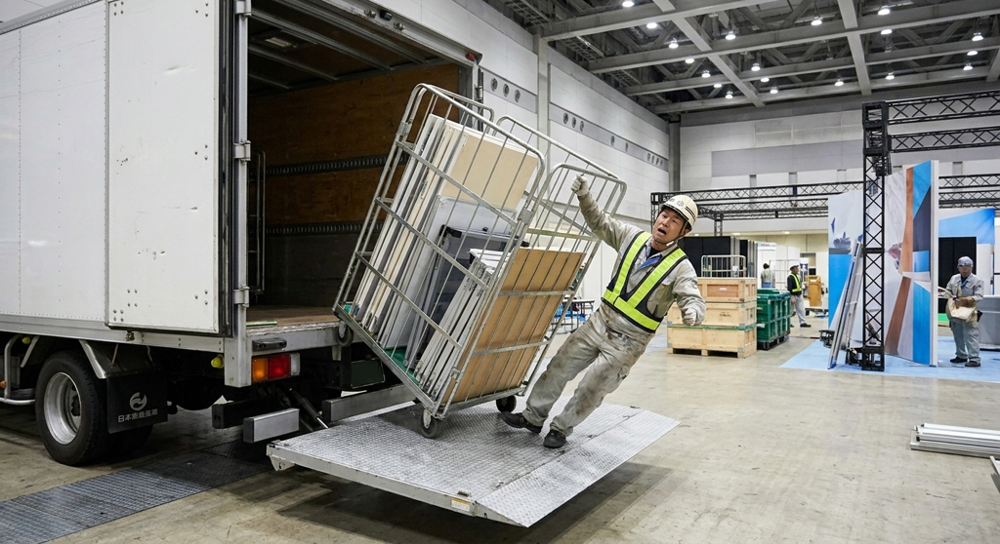
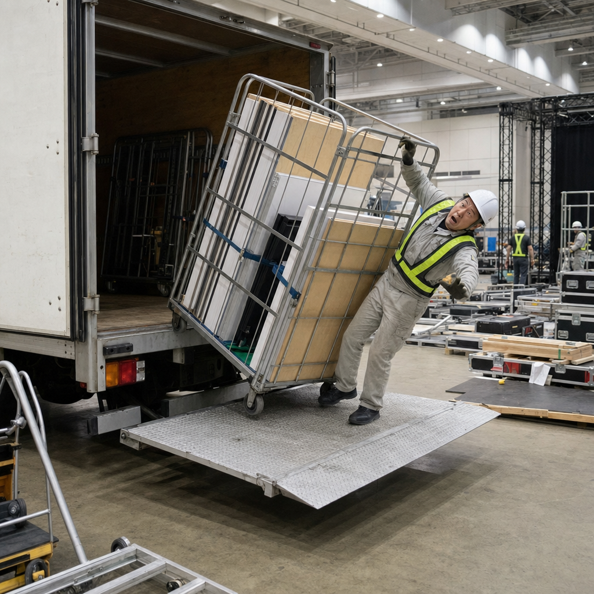
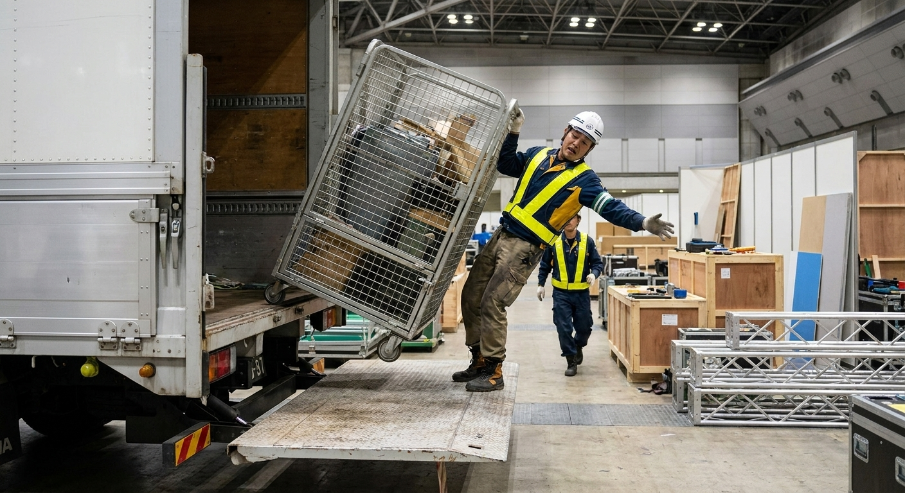

### 前（事故直前） / Phase 1 — Before (lead-up)

**OpenAI Sora 2**

- 【Sora 2／日本語】この画像を開始フレームとして動かす（image-to-video）。ドキュメンタリー調・自然光・手持ちカメラのリアルな実写映像。場面：前（事故直前）。展示会場でトラックのパワーゲート（昇降板）に乗り、荷役作業を行っている。作業員は通常どおり準備・作業を進めており、まだ異常は起きていない平穏な場面。 舞台は日本の展示会・イベント設営会場、登場人物は日本人作業員、トラックのテールゲートリフター（昇降板／パワーゲート）を使用。服装・保護具はあごひも付きヘルメット・ハイビズ（高視認性ベスト）・安全靴。実在ロゴや可読文字は映さない。これは安全教育用の事故再現映像であり、流血・残虐・苦痛の誇張は描かない。約8秒・16:9。
- [Sora 2 / English] Use the provided image as the starting keyframe (image-to-video). Photorealistic documentary footage, natural light, handheld camera. Scene: Phase 1 — Before (lead-up). handling event cargo on a truck power-gate (tail-gate lifter) at an exhibition hall; workers proceed with the build-up task normally — a calm moment, no incident yet. Set at a Japanese exhibition / event build-up venue with Japanese workers using a truck tail-gate lifter / power-gate (rear lift platform). Workers wear hard hat with chin strap, hi-vis vest, safety boots. No real logos or readable text. This is a safety-education re-enactment; no blood, gore or exaggerated suffering. About 8 seconds, 16:9.

**Google Veo 3.1**

- 【Veo 3.1／日本語】開始キーフレーム＝この画像（image-to-video）。被写体：あごひも付きヘルメット・ハイビズ（高視認性ベスト）・安全靴を着けた日本人作業員とトラックのテールゲートリフター（昇降板／パワーゲート）。場面：前（事故直前）。アクション：展示会場でトラックのパワーゲート（昇降板）に乗り、荷役作業を行っている。作業員は通常どおり準備・作業を進めており、まだ異常は起きていない平穏な場面。 カメラ：ゆっくりとした寄り（緩やかなプッシュイン）／手持ちの微振動。ライティング：会場内の自然な照明。スタイル：リアルなドキュメンタリー写真調、実在ロゴ・可読文字なし。安全教育用の再現であり流血・残虐表現は含めない。約8秒・16:9。
- [Veo 3.1 / English] First keyframe = the provided image (image-to-video). Subject: Japanese workers in hard hat with chin strap, hi-vis vest, safety boots with a truck tail-gate lifter / power-gate (rear lift platform). Scene: Phase 1 — Before (lead-up). Action: handling event cargo on a truck power-gate (tail-gate lifter) at an exhibition hall; workers proceed with the build-up task normally — a calm moment, no incident yet. Camera: slow push-in with slight handheld motion. Lighting: natural indoor venue light. Style: realistic documentary photography, no real logos or readable text. A safety-education re-enactment with no blood or gore. About 8 seconds, 16:9.

### 事故の瞬間 / Phase 2 — The moment

**OpenAI Sora 2**

- 【Sora 2／日本語】この画像を開始フレームとして動かす（image-to-video）。ドキュメンタリー調・自然光・手持ちカメラのリアルな実写映像。場面：事故の瞬間。昇降板の開いた縁で作業員が体勢を崩し、外側へ転落しかける瞬間。危険の一瞬を捉える（流血・残虐表現なし）。 舞台は日本の展示会・イベント設営会場、登場人物は日本人作業員、トラックのテールゲートリフター（昇降板／パワーゲート）を使用。服装・保護具はあごひも付きヘルメット・ハイビズ（高視認性ベスト）・安全靴。実在ロゴや可読文字は映さない。これは安全教育用の事故再現映像であり、流血・残虐・苦痛の誇張は描かない。約8秒・16:9。
- [Sora 2 / English] Use the provided image as the starting keyframe (image-to-video). Photorealistic documentary footage, natural light, handheld camera. Scene: Phase 2 — The moment. the worker on the platform overbalances at the open edge and nearly falls off — capture the dangerous instant (no blood, no gore). Set at a Japanese exhibition / event build-up venue with Japanese workers using a truck tail-gate lifter / power-gate (rear lift platform). Workers wear hard hat with chin strap, hi-vis vest, safety boots. No real logos or readable text. This is a safety-education re-enactment; no blood, gore or exaggerated suffering. About 8 seconds, 16:9.

**Google Veo 3.1**

- 【Veo 3.1／日本語】開始キーフレーム＝この画像（image-to-video）。被写体：あごひも付きヘルメット・ハイビズ（高視認性ベスト）・安全靴を着けた日本人作業員とトラックのテールゲートリフター（昇降板／パワーゲート）。場面：事故の瞬間。アクション：昇降板の開いた縁で作業員が体勢を崩し、外側へ転落しかける瞬間。危険の一瞬を捉える（流血・残虐表現なし）。 カメラ：ゆっくりとした寄り（緩やかなプッシュイン）／手持ちの微振動。ライティング：会場内の自然な照明。スタイル：リアルなドキュメンタリー写真調、実在ロゴ・可読文字なし。安全教育用の再現であり流血・残虐表現は含めない。約8秒・16:9。
- [Veo 3.1 / English] First keyframe = the provided image (image-to-video). Subject: Japanese workers in hard hat with chin strap, hi-vis vest, safety boots with a truck tail-gate lifter / power-gate (rear lift platform). Scene: Phase 2 — The moment. Action: the worker on the platform overbalances at the open edge and nearly falls off — capture the dangerous instant (no blood, no gore). Camera: slow push-in with slight handheld motion. Lighting: natural indoor venue light. Style: realistic documentary photography, no real logos or readable text. A safety-education re-enactment with no blood or gore. About 8 seconds, 16:9.

### 後（直後の対応） / Phase 3 — After (response)

**OpenAI Sora 2**

- 【Sora 2／日本語】この画像を開始フレームとして動かす（image-to-video）。ドキュメンタリー調・自然光・手持ちカメラのリアルな実写映像。場面：後（直後の対応）。直ちに作業を中断し、周囲の作業員が駆け寄って安全を確認する。大きな外傷描写はなく、再発防止を促す静かな余韻で終える。 舞台は日本の展示会・イベント設営会場、登場人物は日本人作業員、トラックのテールゲートリフター（昇降板／パワーゲート）を使用。服装・保護具はあごひも付きヘルメット・ハイビズ（高視認性ベスト）・安全靴。実在ロゴや可読文字は映さない。これは安全教育用の事故再現映像であり、流血・残虐・苦痛の誇張は描かない。約8秒・16:9。
- [Sora 2 / English] Use the provided image as the starting keyframe (image-to-video). Photorealistic documentary footage, natural light, handheld camera. Scene: Phase 3 — After (response). work stops immediately; nearby workers rush in and check on safety. No graphic injury; end on a quiet beat that stresses prevention. Set at a Japanese exhibition / event build-up venue with Japanese workers using a truck tail-gate lifter / power-gate (rear lift platform). Workers wear hard hat with chin strap, hi-vis vest, safety boots. No real logos or readable text. This is a safety-education re-enactment; no blood, gore or exaggerated suffering. About 8 seconds, 16:9.

**Google Veo 3.1**

- 【Veo 3.1／日本語】開始キーフレーム＝この画像（image-to-video）。被写体：あごひも付きヘルメット・ハイビズ（高視認性ベスト）・安全靴を着けた日本人作業員とトラックのテールゲートリフター（昇降板／パワーゲート）。場面：後（直後の対応）。アクション：直ちに作業を中断し、周囲の作業員が駆け寄って安全を確認する。大きな外傷描写はなく、再発防止を促す静かな余韻で終える。 カメラ：ゆっくりとした寄り（緩やかなプッシュイン）／手持ちの微振動。ライティング：会場内の自然な照明。スタイル：リアルなドキュメンタリー写真調、実在ロゴ・可読文字なし。安全教育用の再現であり流血・残虐表現は含めない。約8秒・16:9。
- [Veo 3.1 / English] First keyframe = the provided image (image-to-video). Subject: Japanese workers in hard hat with chin strap, hi-vis vest, safety boots with a truck tail-gate lifter / power-gate (rear lift platform). Scene: Phase 3 — After (response). Action: work stops immediately; nearby workers rush in and check on safety. No graphic injury; end on a quiet beat that stresses prevention. Camera: slow push-in with slight handheld motion. Lighting: natural indoor venue light. Style: realistic documentary photography, no real logos or readable text. A safety-education re-enactment with no blood or gore. About 8 seconds, 16:9.

---

## 事故事例 N04　台車を昇降装置へ移す際、台車が落下し下敷きに

- カテゴリ：TGL（トラックのテールゲートリフター（昇降板／パワーゲート））
- 開始フレーム画像：`photos_v16/N04/base.png` ／ `openai.png` ／ `google.png`（3案いずれかを開始/キーフレームに使用）
- 監修：金田 義太（労働安全コンサルタント 登録第4840号）

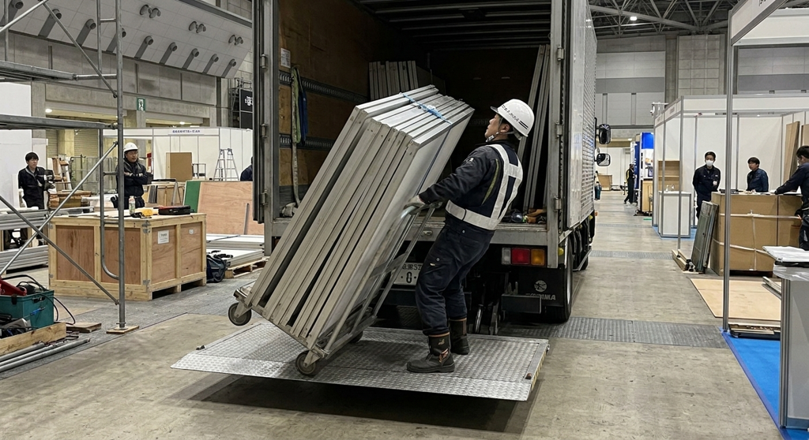
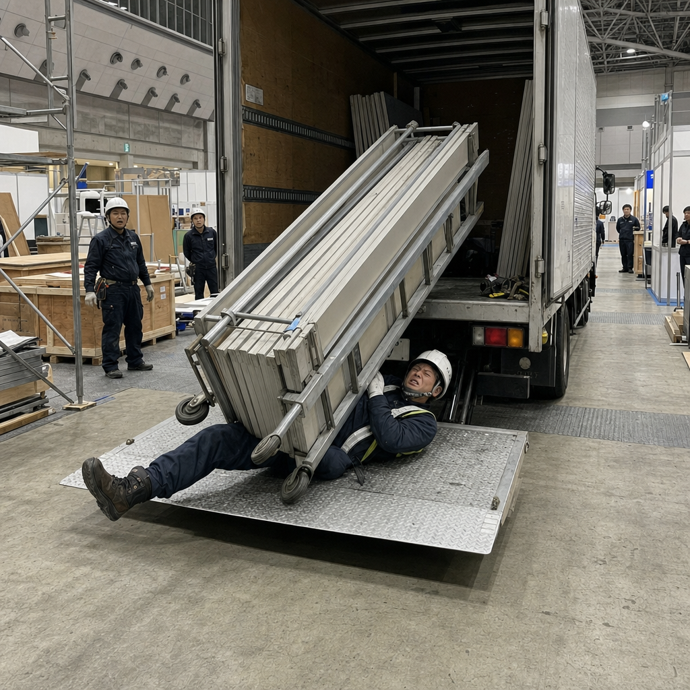
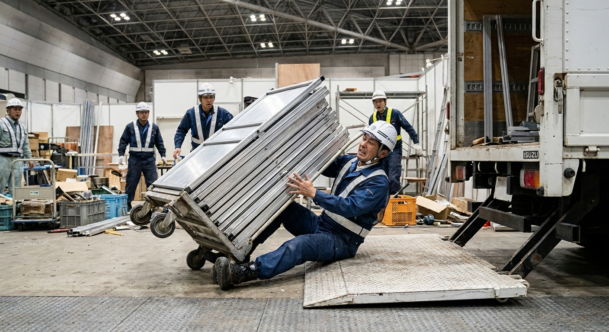

### 前（事故直前） / Phase 1 — Before (lead-up)

**OpenAI Sora 2**

- 【Sora 2／日本語】この画像を開始フレームとして動かす（image-to-video）。ドキュメンタリー調・自然光・手持ちカメラのリアルな実写映像。場面：前（事故直前）。荷台から積み荷を載せた展示用台車を、昇降板へ移そうとしている。作業員は通常どおり準備・作業を進めており、まだ異常は起きていない平穏な場面。 舞台は日本の展示会・イベント設営会場、登場人物は日本人作業員、トラックのテールゲートリフター（昇降板／パワーゲート）を使用。服装・保護具はあごひも付きヘルメット・ハイビズ（高視認性ベスト）・安全靴。実在ロゴや可読文字は映さない。これは安全教育用の事故再現映像であり、流血・残虐・苦痛の誇張は描かない。約8秒・16:9。
- [Sora 2 / English] Use the provided image as the starting keyframe (image-to-video). Photorealistic documentary footage, natural light, handheld camera. Scene: Phase 1 — Before (lead-up). transferring a loaded display cart from the truck bed onto a tail-gate lifter at a venue; workers proceed with the build-up task normally — a calm moment, no incident yet. Set at a Japanese exhibition / event build-up venue with Japanese workers using a truck tail-gate lifter / power-gate (rear lift platform). Workers wear hard hat with chin strap, hi-vis vest, safety boots. No real logos or readable text. This is a safety-education re-enactment; no blood, gore or exaggerated suffering. About 8 seconds, 16:9.

**Google Veo 3.1**

- 【Veo 3.1／日本語】開始キーフレーム＝この画像（image-to-video）。被写体：あごひも付きヘルメット・ハイビズ（高視認性ベスト）・安全靴を着けた日本人作業員とトラックのテールゲートリフター（昇降板／パワーゲート）。場面：前（事故直前）。アクション：荷台から積み荷を載せた展示用台車を、昇降板へ移そうとしている。作業員は通常どおり準備・作業を進めており、まだ異常は起きていない平穏な場面。 カメラ：ゆっくりとした寄り（緩やかなプッシュイン）／手持ちの微振動。ライティング：会場内の自然な照明。スタイル：リアルなドキュメンタリー写真調、実在ロゴ・可読文字なし。安全教育用の再現であり流血・残虐表現は含めない。約8秒・16:9。
- [Veo 3.1 / English] First keyframe = the provided image (image-to-video). Subject: Japanese workers in hard hat with chin strap, hi-vis vest, safety boots with a truck tail-gate lifter / power-gate (rear lift platform). Scene: Phase 1 — Before (lead-up). Action: transferring a loaded display cart from the truck bed onto a tail-gate lifter at a venue; workers proceed with the build-up task normally — a calm moment, no incident yet. Camera: slow push-in with slight handheld motion. Lighting: natural indoor venue light. Style: realistic documentary photography, no real logos or readable text. A safety-education re-enactment with no blood or gore. About 8 seconds, 16:9.

### 事故の瞬間 / Phase 2 — The moment

**OpenAI Sora 2**

- 【Sora 2／日本語】この画像を開始フレームとして動かす（image-to-video）。ドキュメンタリー調・自然光・手持ちカメラのリアルな実写映像。場面：事故の瞬間。台車が昇降板から傾いて落下し、作業員が下敷きになりそうになる瞬間。危険の一瞬を捉える（流血・残虐表現なし）。 舞台は日本の展示会・イベント設営会場、登場人物は日本人作業員、トラックのテールゲートリフター（昇降板／パワーゲート）を使用。服装・保護具はあごひも付きヘルメット・ハイビズ（高視認性ベスト）・安全靴。実在ロゴや可読文字は映さない。これは安全教育用の事故再現映像であり、流血・残虐・苦痛の誇張は描かない。約8秒・16:9。
- [Sora 2 / English] Use the provided image as the starting keyframe (image-to-video). Photorealistic documentary footage, natural light, handheld camera. Scene: Phase 2 — The moment. the loaded cart tips and drops off the platform and the worker is struck/pinned under it — capture the dangerous instant (no blood, no gore). Set at a Japanese exhibition / event build-up venue with Japanese workers using a truck tail-gate lifter / power-gate (rear lift platform). Workers wear hard hat with chin strap, hi-vis vest, safety boots. No real logos or readable text. This is a safety-education re-enactment; no blood, gore or exaggerated suffering. About 8 seconds, 16:9.

**Google Veo 3.1**

- 【Veo 3.1／日本語】開始キーフレーム＝この画像（image-to-video）。被写体：あごひも付きヘルメット・ハイビズ（高視認性ベスト）・安全靴を着けた日本人作業員とトラックのテールゲートリフター（昇降板／パワーゲート）。場面：事故の瞬間。アクション：台車が昇降板から傾いて落下し、作業員が下敷きになりそうになる瞬間。危険の一瞬を捉える（流血・残虐表現なし）。 カメラ：ゆっくりとした寄り（緩やかなプッシュイン）／手持ちの微振動。ライティング：会場内の自然な照明。スタイル：リアルなドキュメンタリー写真調、実在ロゴ・可読文字なし。安全教育用の再現であり流血・残虐表現は含めない。約8秒・16:9。
- [Veo 3.1 / English] First keyframe = the provided image (image-to-video). Subject: Japanese workers in hard hat with chin strap, hi-vis vest, safety boots with a truck tail-gate lifter / power-gate (rear lift platform). Scene: Phase 2 — The moment. Action: the loaded cart tips and drops off the platform and the worker is struck/pinned under it — capture the dangerous instant (no blood, no gore). Camera: slow push-in with slight handheld motion. Lighting: natural indoor venue light. Style: realistic documentary photography, no real logos or readable text. A safety-education re-enactment with no blood or gore. About 8 seconds, 16:9.

### 後（直後の対応） / Phase 3 — After (response)

**OpenAI Sora 2**

- 【Sora 2／日本語】この画像を開始フレームとして動かす（image-to-video）。ドキュメンタリー調・自然光・手持ちカメラのリアルな実写映像。場面：後（直後の対応）。直ちに作業を中断し、周囲の作業員が駆け寄って安全を確認する。大きな外傷描写はなく、再発防止を促す静かな余韻で終える。 舞台は日本の展示会・イベント設営会場、登場人物は日本人作業員、トラックのテールゲートリフター（昇降板／パワーゲート）を使用。服装・保護具はあごひも付きヘルメット・ハイビズ（高視認性ベスト）・安全靴。実在ロゴや可読文字は映さない。これは安全教育用の事故再現映像であり、流血・残虐・苦痛の誇張は描かない。約8秒・16:9。
- [Sora 2 / English] Use the provided image as the starting keyframe (image-to-video). Photorealistic documentary footage, natural light, handheld camera. Scene: Phase 3 — After (response). work stops immediately; nearby workers rush in and check on safety. No graphic injury; end on a quiet beat that stresses prevention. Set at a Japanese exhibition / event build-up venue with Japanese workers using a truck tail-gate lifter / power-gate (rear lift platform). Workers wear hard hat with chin strap, hi-vis vest, safety boots. No real logos or readable text. This is a safety-education re-enactment; no blood, gore or exaggerated suffering. About 8 seconds, 16:9.

**Google Veo 3.1**

- 【Veo 3.1／日本語】開始キーフレーム＝この画像（image-to-video）。被写体：あごひも付きヘルメット・ハイビズ（高視認性ベスト）・安全靴を着けた日本人作業員とトラックのテールゲートリフター（昇降板／パワーゲート）。場面：後（直後の対応）。アクション：直ちに作業を中断し、周囲の作業員が駆け寄って安全を確認する。大きな外傷描写はなく、再発防止を促す静かな余韻で終える。 カメラ：ゆっくりとした寄り（緩やかなプッシュイン）／手持ちの微振動。ライティング：会場内の自然な照明。スタイル：リアルなドキュメンタリー写真調、実在ロゴ・可読文字なし。安全教育用の再現であり流血・残虐表現は含めない。約8秒・16:9。
- [Veo 3.1 / English] First keyframe = the provided image (image-to-video). Subject: Japanese workers in hard hat with chin strap, hi-vis vest, safety boots with a truck tail-gate lifter / power-gate (rear lift platform). Scene: Phase 3 — After (response). Action: work stops immediately; nearby workers rush in and check on safety. No graphic injury; end on a quiet beat that stresses prevention. Camera: slow push-in with slight handheld motion. Lighting: natural indoor venue light. Style: realistic documentary photography, no real logos or readable text. A safety-education re-enactment with no blood or gore. About 8 seconds, 16:9.

---

## 事故事例 N05　荷下ろし中、カゴ台車が倒れ作業員が転倒

- カテゴリ：TGL（トラックのテールゲートリフター（昇降板／パワーゲート））
- 開始フレーム画像：`photos_v16/N05/base.png` ／ `openai.png` ／ `google.png`（3案いずれかを開始/キーフレームに使用）
- 監修：金田 義太（労働安全コンサルタント 登録第4840号）

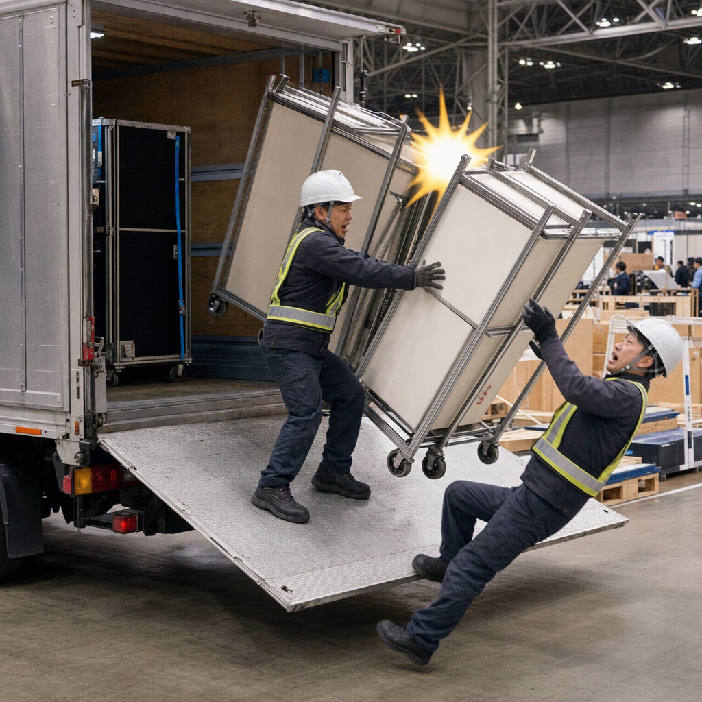
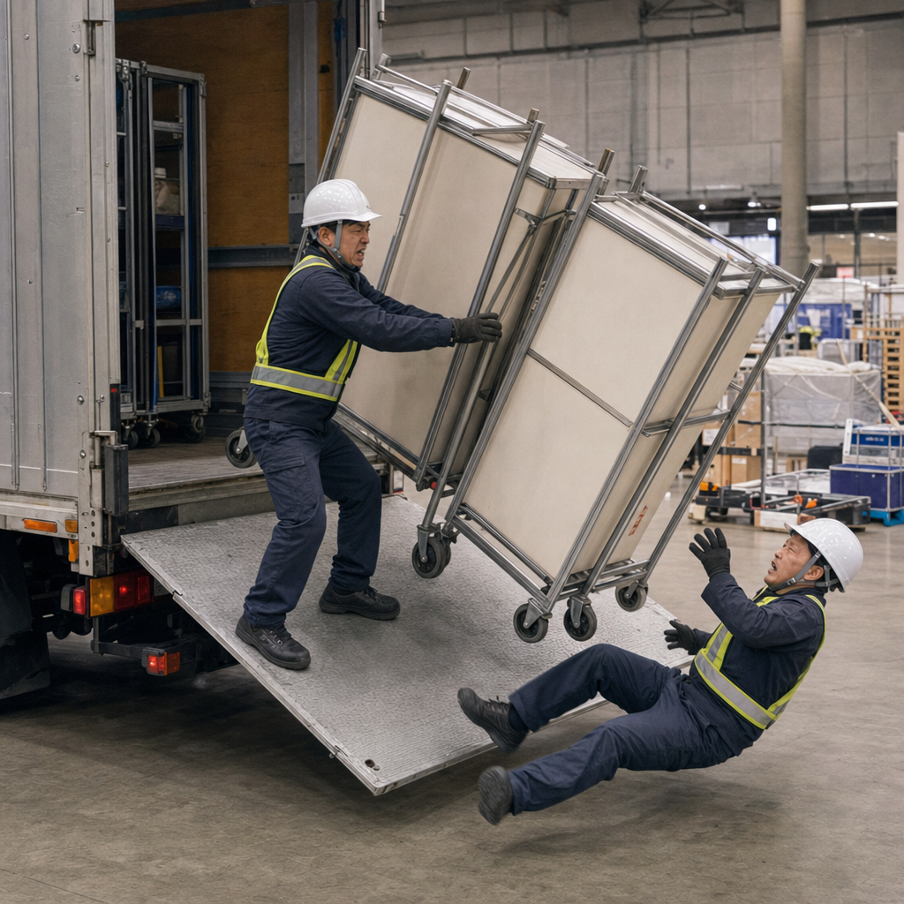
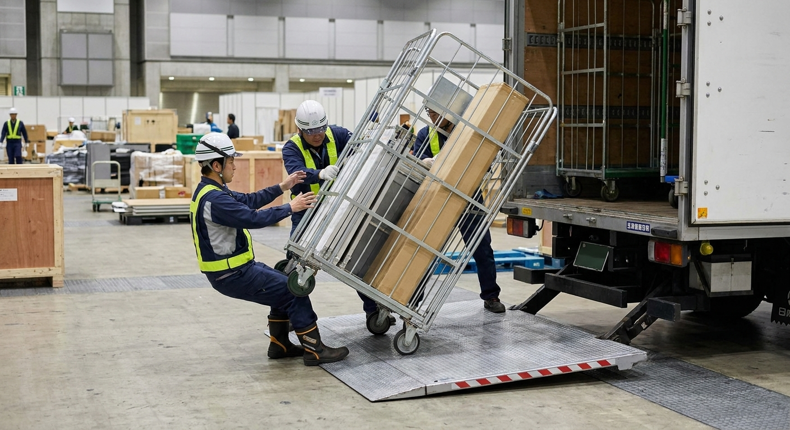

### 前（事故直前） / Phase 1 — Before (lead-up)

**OpenAI Sora 2**

- 【Sora 2／日本語】この画像を開始フレームとして動かす（image-to-video）。ドキュメンタリー調・自然光・手持ちカメラのリアルな実写映像。場面：前（事故直前）。会場搬入口で、展示資材を積んだカゴ台車（ロールボックス）を荷下ろししている。作業員は通常どおり準備・作業を進めており、まだ異常は起きていない平穏な場面。 舞台は日本の展示会・イベント設営会場、登場人物は日本人作業員、トラックのテールゲートリフター（昇降板／パワーゲート）を使用。服装・保護具はあごひも付きヘルメット・ハイビズ（高視認性ベスト）・安全靴。実在ロゴや可読文字は映さない。これは安全教育用の事故再現映像であり、流血・残虐・苦痛の誇張は描かない。約8秒・16:9。
- [Sora 2 / English] Use the provided image as the starting keyframe (image-to-video). Photorealistic documentary footage, natural light, handheld camera. Scene: Phase 1 — Before (lead-up). unloading roll-cages of exhibition materials at an event loading bay; workers proceed with the build-up task normally — a calm moment, no incident yet. Set at a Japanese exhibition / event build-up venue with Japanese workers using a truck tail-gate lifter / power-gate (rear lift platform). Workers wear hard hat with chin strap, hi-vis vest, safety boots. No real logos or readable text. This is a safety-education re-enactment; no blood, gore or exaggerated suffering. About 8 seconds, 16:9.

**Google Veo 3.1**

- 【Veo 3.1／日本語】開始キーフレーム＝この画像（image-to-video）。被写体：あごひも付きヘルメット・ハイビズ（高視認性ベスト）・安全靴を着けた日本人作業員とトラックのテールゲートリフター（昇降板／パワーゲート）。場面：前（事故直前）。アクション：会場搬入口で、展示資材を積んだカゴ台車（ロールボックス）を荷下ろししている。作業員は通常どおり準備・作業を進めており、まだ異常は起きていない平穏な場面。 カメラ：ゆっくりとした寄り（緩やかなプッシュイン）／手持ちの微振動。ライティング：会場内の自然な照明。スタイル：リアルなドキュメンタリー写真調、実在ロゴ・可読文字なし。安全教育用の再現であり流血・残虐表現は含めない。約8秒・16:9。
- [Veo 3.1 / English] First keyframe = the provided image (image-to-video). Subject: Japanese workers in hard hat with chin strap, hi-vis vest, safety boots with a truck tail-gate lifter / power-gate (rear lift platform). Scene: Phase 1 — Before (lead-up). Action: unloading roll-cages of exhibition materials at an event loading bay; workers proceed with the build-up task normally — a calm moment, no incident yet. Camera: slow push-in with slight handheld motion. Lighting: natural indoor venue light. Style: realistic documentary photography, no real logos or readable text. A safety-education re-enactment with no blood or gore. About 8 seconds, 16:9.

### 事故の瞬間 / Phase 2 — The moment

**OpenAI Sora 2**

- 【Sora 2／日本語】この画像を開始フレームとして動かす（image-to-video）。ドキュメンタリー調・自然光・手持ちカメラのリアルな実写映像。場面：事故の瞬間。カゴ台車が別の台車と接触して倒れ、支えようとした作業員が押されて転倒する瞬間。危険の一瞬を捉える（流血・残虐表現なし）。 舞台は日本の展示会・イベント設営会場、登場人物は日本人作業員、トラックのテールゲートリフター（昇降板／パワーゲート）を使用。服装・保護具はあごひも付きヘルメット・ハイビズ（高視認性ベスト）・安全靴。実在ロゴや可読文字は映さない。これは安全教育用の事故再現映像であり、流血・残虐・苦痛の誇張は描かない。約8秒・16:9。
- [Sora 2 / English] Use the provided image as the starting keyframe (image-to-video). Photorealistic documentary footage, natural light, handheld camera. Scene: Phase 2 — The moment. a cargo roll-cage collides with another cart, topples, and the worker bracing it is knocked down — capture the dangerous instant (no blood, no gore). Set at a Japanese exhibition / event build-up venue with Japanese workers using a truck tail-gate lifter / power-gate (rear lift platform). Workers wear hard hat with chin strap, hi-vis vest, safety boots. No real logos or readable text. This is a safety-education re-enactment; no blood, gore or exaggerated suffering. About 8 seconds, 16:9.

**Google Veo 3.1**

- 【Veo 3.1／日本語】開始キーフレーム＝この画像（image-to-video）。被写体：あごひも付きヘルメット・ハイビズ（高視認性ベスト）・安全靴を着けた日本人作業員とトラックのテールゲートリフター（昇降板／パワーゲート）。場面：事故の瞬間。アクション：カゴ台車が別の台車と接触して倒れ、支えようとした作業員が押されて転倒する瞬間。危険の一瞬を捉える（流血・残虐表現なし）。 カメラ：ゆっくりとした寄り（緩やかなプッシュイン）／手持ちの微振動。ライティング：会場内の自然な照明。スタイル：リアルなドキュメンタリー写真調、実在ロゴ・可読文字なし。安全教育用の再現であり流血・残虐表現は含めない。約8秒・16:9。
- [Veo 3.1 / English] First keyframe = the provided image (image-to-video). Subject: Japanese workers in hard hat with chin strap, hi-vis vest, safety boots with a truck tail-gate lifter / power-gate (rear lift platform). Scene: Phase 2 — The moment. Action: a cargo roll-cage collides with another cart, topples, and the worker bracing it is knocked down — capture the dangerous instant (no blood, no gore). Camera: slow push-in with slight handheld motion. Lighting: natural indoor venue light. Style: realistic documentary photography, no real logos or readable text. A safety-education re-enactment with no blood or gore. About 8 seconds, 16:9.

### 後（直後の対応） / Phase 3 — After (response)

**OpenAI Sora 2**

- 【Sora 2／日本語】この画像を開始フレームとして動かす（image-to-video）。ドキュメンタリー調・自然光・手持ちカメラのリアルな実写映像。場面：後（直後の対応）。直ちに作業を中断し、周囲の作業員が駆け寄って安全を確認する。大きな外傷描写はなく、再発防止を促す静かな余韻で終える。 舞台は日本の展示会・イベント設営会場、登場人物は日本人作業員、トラックのテールゲートリフター（昇降板／パワーゲート）を使用。服装・保護具はあごひも付きヘルメット・ハイビズ（高視認性ベスト）・安全靴。実在ロゴや可読文字は映さない。これは安全教育用の事故再現映像であり、流血・残虐・苦痛の誇張は描かない。約8秒・16:9。
- [Sora 2 / English] Use the provided image as the starting keyframe (image-to-video). Photorealistic documentary footage, natural light, handheld camera. Scene: Phase 3 — After (response). work stops immediately; nearby workers rush in and check on safety. No graphic injury; end on a quiet beat that stresses prevention. Set at a Japanese exhibition / event build-up venue with Japanese workers using a truck tail-gate lifter / power-gate (rear lift platform). Workers wear hard hat with chin strap, hi-vis vest, safety boots. No real logos or readable text. This is a safety-education re-enactment; no blood, gore or exaggerated suffering. About 8 seconds, 16:9.

**Google Veo 3.1**

- 【Veo 3.1／日本語】開始キーフレーム＝この画像（image-to-video）。被写体：あごひも付きヘルメット・ハイビズ（高視認性ベスト）・安全靴を着けた日本人作業員とトラックのテールゲートリフター（昇降板／パワーゲート）。場面：後（直後の対応）。アクション：直ちに作業を中断し、周囲の作業員が駆け寄って安全を確認する。大きな外傷描写はなく、再発防止を促す静かな余韻で終える。 カメラ：ゆっくりとした寄り（緩やかなプッシュイン）／手持ちの微振動。ライティング：会場内の自然な照明。スタイル：リアルなドキュメンタリー写真調、実在ロゴ・可読文字なし。安全教育用の再現であり流血・残虐表現は含めない。約8秒・16:9。
- [Veo 3.1 / English] First keyframe = the provided image (image-to-video). Subject: Japanese workers in hard hat with chin strap, hi-vis vest, safety boots with a truck tail-gate lifter / power-gate (rear lift platform). Scene: Phase 3 — After (response). Action: work stops immediately; nearby workers rush in and check on safety. No graphic injury; end on a quiet beat that stresses prevention. Camera: slow push-in with slight handheld motion. Lighting: natural indoor venue light. Style: realistic documentary photography, no real logos or readable text. A safety-education re-enactment with no blood or gore. About 8 seconds, 16:9.

---

## 事故事例 N06　会場天井付近の作業中、作業床手すりと上方構造物の間に挟まれ

- カテゴリ：高所（高所作業車（ブーム式／シザー式・作業床付き））
- 開始フレーム画像：`photos_v16/N06/base.png` ／ `openai.png` ／ `google.png`（3案いずれかを開始/キーフレームに使用）
- 監修：金田 義太（労働安全コンサルタント 登録第4840号）

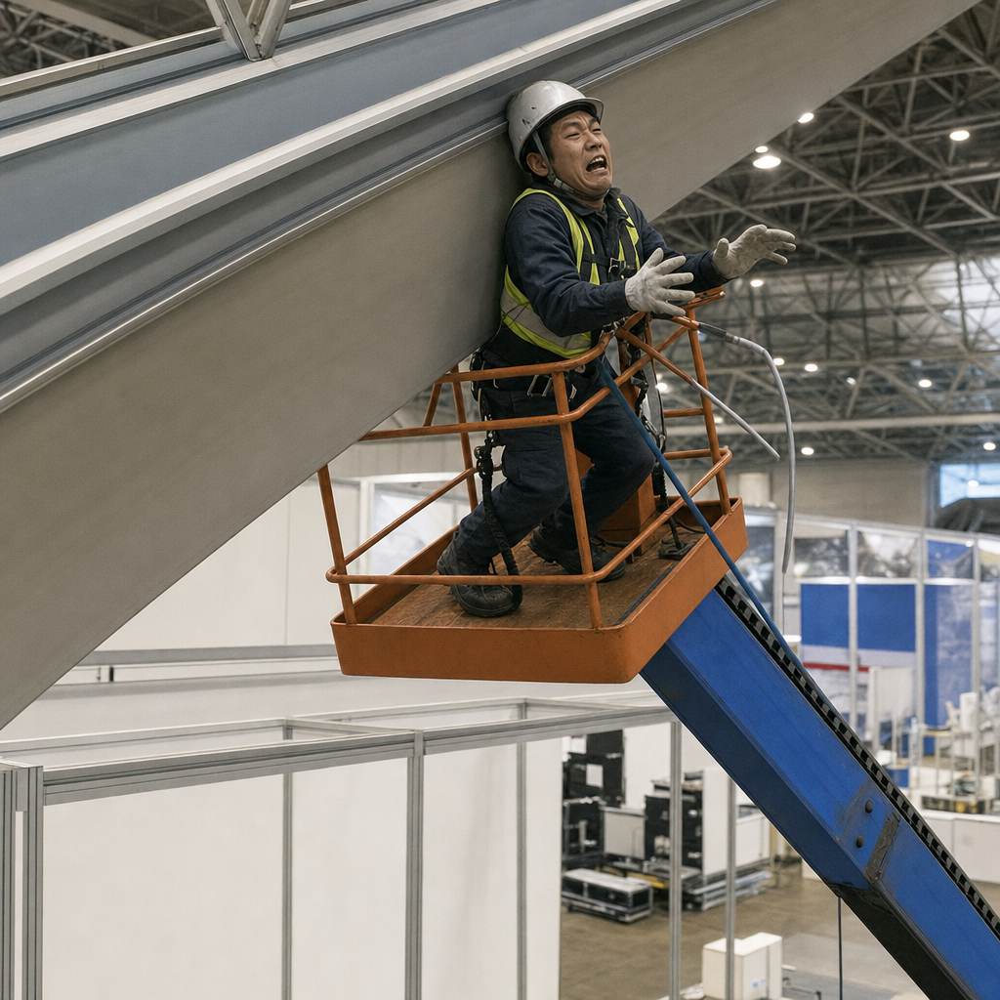
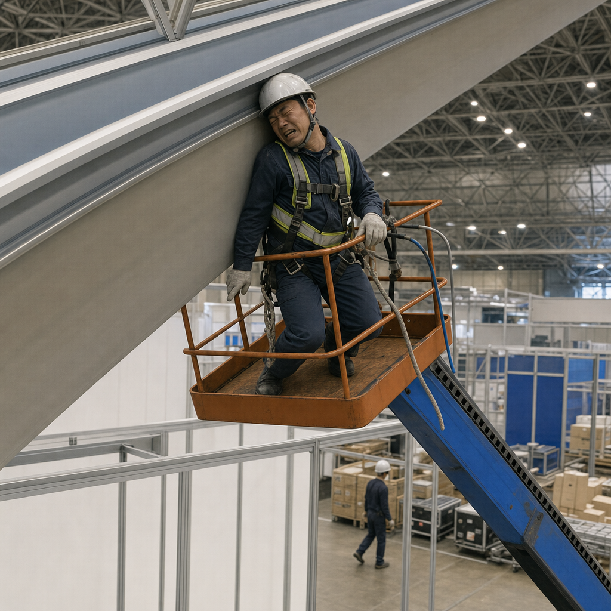
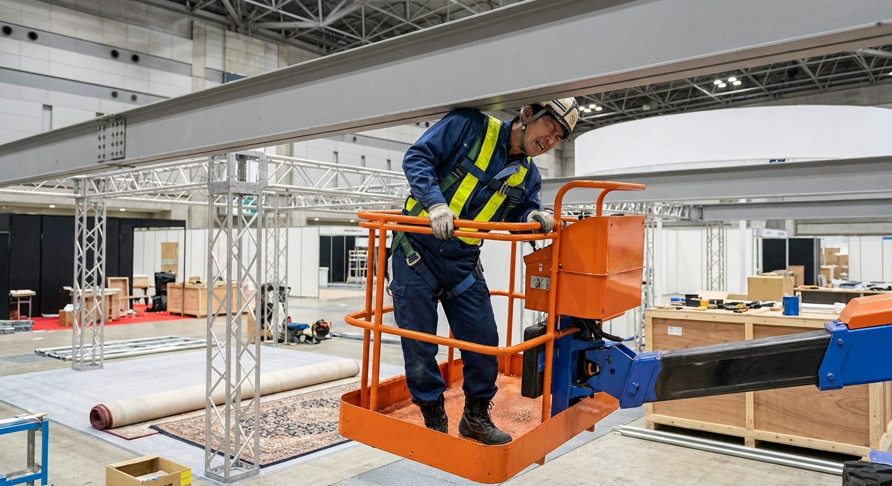

### 前（事故直前） / Phase 1 — Before (lead-up)

**OpenAI Sora 2**

- 【Sora 2／日本語】この画像を開始フレームとして動かす（image-to-video）。ドキュメンタリー調・自然光・手持ちカメラのリアルな実写映像。場面：前（事故直前）。展示会場の天井付近。高所作業車のバケット（作業床）に乗り、配線・吊り作業のためバケットを旋回・移動させている。作業員は通常どおり準備・作業を進めており、まだ異常は起きていない平穏な場面。 舞台は日本の展示会・イベント設営会場、登場人物は日本人作業員、高所作業車（ブーム式／シザー式・作業床付き）を使用。服装・保護具はあごひも付きヘルメット・ハイビズ（高視認性ベスト）・安全靴・フルハーネス型安全帯。実在ロゴや可読文字は映さない。これは安全教育用の事故再現映像であり、流血・残虐・苦痛の誇張は描かない。約8秒・16:9。
- [Sora 2 / English] Use the provided image as the starting keyframe (image-to-video). Photorealistic documentary footage, natural light, handheld camera. Scene: Phase 1 — Before (lead-up). overhead work at an exhibition hall (ceiling rail/truss) using an aerial work platform; workers proceed with the build-up task normally — a calm moment, no incident yet. Set at a Japanese exhibition / event build-up venue with Japanese workers using a Japanese aerial work platform / MEWP (boom or scissor lift with a work basket). Workers wear hard hat with chin strap, hi-vis vest, safety boots, full-body safety harness. No real logos or readable text. This is a safety-education re-enactment; no blood, gore or exaggerated suffering. About 8 seconds, 16:9.

**Google Veo 3.1**

- 【Veo 3.1／日本語】開始キーフレーム＝この画像（image-to-video）。被写体：あごひも付きヘルメット・ハイビズ（高視認性ベスト）・安全靴・フルハーネス型安全帯を着けた日本人作業員と高所作業車（ブーム式／シザー式・作業床付き）。場面：前（事故直前）。アクション：展示会場の天井付近。高所作業車のバケット（作業床）に乗り、配線・吊り作業のためバケットを旋回・移動させている。作業員は通常どおり準備・作業を進めており、まだ異常は起きていない平穏な場面。 カメラ：ゆっくりとした寄り（緩やかなプッシュイン）／手持ちの微振動。ライティング：会場内の自然な照明。スタイル：リアルなドキュメンタリー写真調、実在ロゴ・可読文字なし。安全教育用の再現であり流血・残虐表現は含めない。約8秒・16:9。
- [Veo 3.1 / English] First keyframe = the provided image (image-to-video). Subject: Japanese workers in hard hat with chin strap, hi-vis vest, safety boots, full-body safety harness with a Japanese aerial work platform / MEWP (boom or scissor lift with a work basket). Scene: Phase 1 — Before (lead-up). Action: overhead work at an exhibition hall (ceiling rail/truss) using an aerial work platform; workers proceed with the build-up task normally — a calm moment, no incident yet. Camera: slow push-in with slight handheld motion. Lighting: natural indoor venue light. Style: realistic documentary photography, no real logos or readable text. A safety-education re-enactment with no blood or gore. About 8 seconds, 16:9.

### 事故の瞬間 / Phase 2 — The moment

**OpenAI Sora 2**

- 【Sora 2／日本語】この画像を開始フレームとして動かす（image-to-video）。ドキュメンタリー調・自然光・手持ちカメラのリアルな実写映像。場面：事故の瞬間。据付け地盤の凹凸で車体が揺れ、バケットの手すりと頭上の天井レール・梁の間に作業者の腰部が挟まれそうになる瞬間。危険の一瞬を捉える（流血・残虐表現なし）。 舞台は日本の展示会・イベント設営会場、登場人物は日本人作業員、高所作業車（ブーム式／シザー式・作業床付き）を使用。服装・保護具はあごひも付きヘルメット・ハイビズ（高視認性ベスト）・安全靴・フルハーネス型安全帯。実在ロゴや可読文字は映さない。これは安全教育用の事故再現映像であり、流血・残虐・苦痛の誇張は描かない。約8秒・16:9。
- [Sora 2 / English] Use the provided image as the starting keyframe (image-to-video). Photorealistic documentary footage, natural light, handheld camera. Scene: Phase 2 — The moment. the worker in the basket is pinched at the waist between the basket top rail and an overhead structure as the basket moves on uneven ground — capture the dangerous instant (no blood, no gore). Set at a Japanese exhibition / event build-up venue with Japanese workers using a Japanese aerial work platform / MEWP (boom or scissor lift with a work basket). Workers wear hard hat with chin strap, hi-vis vest, safety boots, full-body safety harness. No real logos or readable text. This is a safety-education re-enactment; no blood, gore or exaggerated suffering. About 8 seconds, 16:9.

**Google Veo 3.1**

- 【Veo 3.1／日本語】開始キーフレーム＝この画像（image-to-video）。被写体：あごひも付きヘルメット・ハイビズ（高視認性ベスト）・安全靴・フルハーネス型安全帯を着けた日本人作業員と高所作業車（ブーム式／シザー式・作業床付き）。場面：事故の瞬間。アクション：据付け地盤の凹凸で車体が揺れ、バケットの手すりと頭上の天井レール・梁の間に作業者の腰部が挟まれそうになる瞬間。危険の一瞬を捉える（流血・残虐表現なし）。 カメラ：ゆっくりとした寄り（緩やかなプッシュイン）／手持ちの微振動。ライティング：会場内の自然な照明。スタイル：リアルなドキュメンタリー写真調、実在ロゴ・可読文字なし。安全教育用の再現であり流血・残虐表現は含めない。約8秒・16:9。
- [Veo 3.1 / English] First keyframe = the provided image (image-to-video). Subject: Japanese workers in hard hat with chin strap, hi-vis vest, safety boots, full-body safety harness with a Japanese aerial work platform / MEWP (boom or scissor lift with a work basket). Scene: Phase 2 — The moment. Action: the worker in the basket is pinched at the waist between the basket top rail and an overhead structure as the basket moves on uneven ground — capture the dangerous instant (no blood, no gore). Camera: slow push-in with slight handheld motion. Lighting: natural indoor venue light. Style: realistic documentary photography, no real logos or readable text. A safety-education re-enactment with no blood or gore. About 8 seconds, 16:9.

### 後（直後の対応） / Phase 3 — After (response)

**OpenAI Sora 2**

- 【Sora 2／日本語】この画像を開始フレームとして動かす（image-to-video）。ドキュメンタリー調・自然光・手持ちカメラのリアルな実写映像。場面：後（直後の対応）。直ちに作業を中断し、周囲の作業員が駆け寄って安全を確認する。大きな外傷描写はなく、再発防止を促す静かな余韻で終える。 舞台は日本の展示会・イベント設営会場、登場人物は日本人作業員、高所作業車（ブーム式／シザー式・作業床付き）を使用。服装・保護具はあごひも付きヘルメット・ハイビズ（高視認性ベスト）・安全靴・フルハーネス型安全帯。実在ロゴや可読文字は映さない。これは安全教育用の事故再現映像であり、流血・残虐・苦痛の誇張は描かない。約8秒・16:9。
- [Sora 2 / English] Use the provided image as the starting keyframe (image-to-video). Photorealistic documentary footage, natural light, handheld camera. Scene: Phase 3 — After (response). work stops immediately; nearby workers rush in and check on safety. No graphic injury; end on a quiet beat that stresses prevention. Set at a Japanese exhibition / event build-up venue with Japanese workers using a Japanese aerial work platform / MEWP (boom or scissor lift with a work basket). Workers wear hard hat with chin strap, hi-vis vest, safety boots, full-body safety harness. No real logos or readable text. This is a safety-education re-enactment; no blood, gore or exaggerated suffering. About 8 seconds, 16:9.

**Google Veo 3.1**

- 【Veo 3.1／日本語】開始キーフレーム＝この画像（image-to-video）。被写体：あごひも付きヘルメット・ハイビズ（高視認性ベスト）・安全靴・フルハーネス型安全帯を着けた日本人作業員と高所作業車（ブーム式／シザー式・作業床付き）。場面：後（直後の対応）。アクション：直ちに作業を中断し、周囲の作業員が駆け寄って安全を確認する。大きな外傷描写はなく、再発防止を促す静かな余韻で終える。 カメラ：ゆっくりとした寄り（緩やかなプッシュイン）／手持ちの微振動。ライティング：会場内の自然な照明。スタイル：リアルなドキュメンタリー写真調、実在ロゴ・可読文字なし。安全教育用の再現であり流血・残虐表現は含めない。約8秒・16:9。
- [Veo 3.1 / English] First keyframe = the provided image (image-to-video). Subject: Japanese workers in hard hat with chin strap, hi-vis vest, safety boots, full-body safety harness with a Japanese aerial work platform / MEWP (boom or scissor lift with a work basket). Scene: Phase 3 — After (response). Action: work stops immediately; nearby workers rush in and check on safety. No graphic injury; end on a quiet beat that stresses prevention. Camera: slow push-in with slight handheld motion. Lighting: natural indoor venue light. Style: realistic documentary photography, no real logos or readable text. A safety-education re-enactment with no blood or gore. About 8 seconds, 16:9.

---

## 事故事例 N07　梁下を移動中、上方の梁と操作盤の間に挟まれ

- カテゴリ：高所（高所作業車（ブーム式／シザー式・作業床付き））
- 開始フレーム画像：`photos_v16/N07/base.png` ／ `openai.png` ／ `google.png`（3案いずれかを開始/キーフレームに使用）
- 監修：金田 義太（労働安全コンサルタント 登録第4840号）

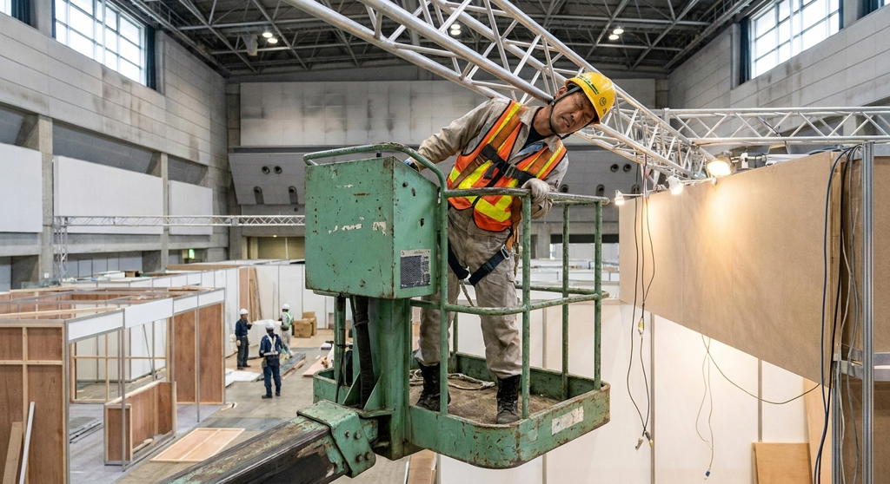
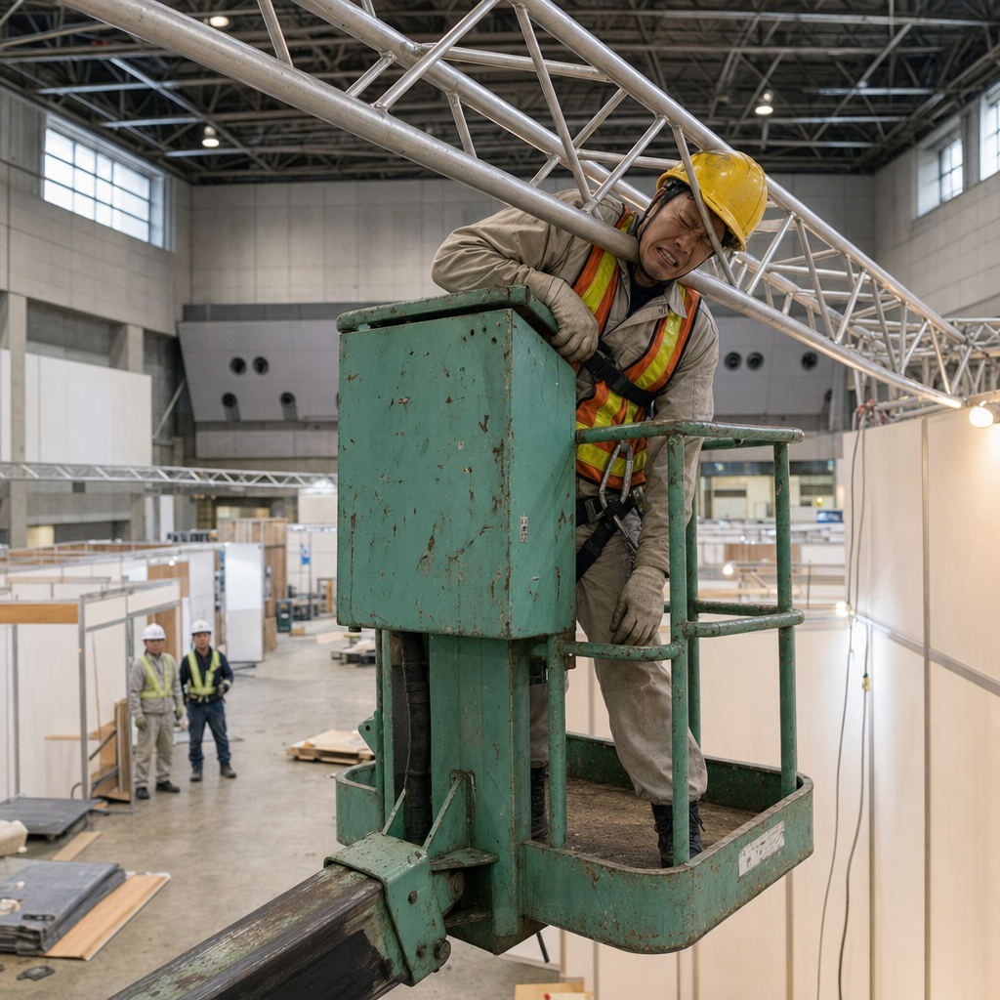
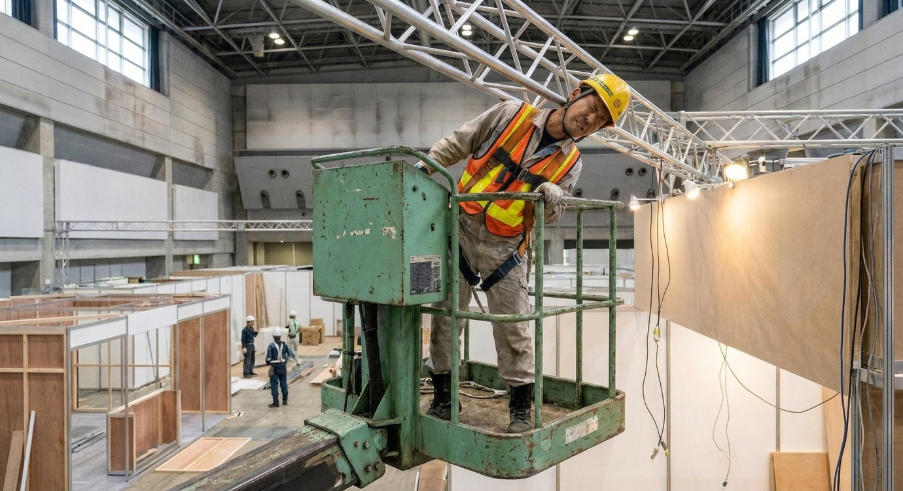

### 前（事故直前） / Phase 1 — Before (lead-up)

**OpenAI Sora 2**

- 【Sora 2／日本語】この画像を開始フレームとして動かす（image-to-video）。ドキュメンタリー調・自然光・手持ちカメラのリアルな実写映像。場面：前（事故直前）。会場の天井梁の下で、高所作業車のバケットを移動させている。作業員は通常どおり準備・作業を進めており、まだ異常は起きていない平穏な場面。 舞台は日本の展示会・イベント設営会場、登場人物は日本人作業員、高所作業車（ブーム式／シザー式・作業床付き）を使用。服装・保護具はあごひも付きヘルメット・ハイビズ（高視認性ベスト）・安全靴・フルハーネス型安全帯。実在ロゴや可読文字は映さない。これは安全教育用の事故再現映像であり、流血・残虐・苦痛の誇張は描かない。約8秒・16:9。
- [Sora 2 / English] Use the provided image as the starting keyframe (image-to-video). Photorealistic documentary footage, natural light, handheld camera. Scene: Phase 1 — Before (lead-up). moving an aerial work platform under a ceiling beam/truss at a venue; workers proceed with the build-up task normally — a calm moment, no incident yet. Set at a Japanese exhibition / event build-up venue with Japanese workers using a Japanese aerial work platform / MEWP (boom or scissor lift with a work basket). Workers wear hard hat with chin strap, hi-vis vest, safety boots, full-body safety harness. No real logos or readable text. This is a safety-education re-enactment; no blood, gore or exaggerated suffering. About 8 seconds, 16:9.

**Google Veo 3.1**

- 【Veo 3.1／日本語】開始キーフレーム＝この画像（image-to-video）。被写体：あごひも付きヘルメット・ハイビズ（高視認性ベスト）・安全靴・フルハーネス型安全帯を着けた日本人作業員と高所作業車（ブーム式／シザー式・作業床付き）。場面：前（事故直前）。アクション：会場の天井梁の下で、高所作業車のバケットを移動させている。作業員は通常どおり準備・作業を進めており、まだ異常は起きていない平穏な場面。 カメラ：ゆっくりとした寄り（緩やかなプッシュイン）／手持ちの微振動。ライティング：会場内の自然な照明。スタイル：リアルなドキュメンタリー写真調、実在ロゴ・可読文字なし。安全教育用の再現であり流血・残虐表現は含めない。約8秒・16:9。
- [Veo 3.1 / English] First keyframe = the provided image (image-to-video). Subject: Japanese workers in hard hat with chin strap, hi-vis vest, safety boots, full-body safety harness with a Japanese aerial work platform / MEWP (boom or scissor lift with a work basket). Scene: Phase 1 — Before (lead-up). Action: moving an aerial work platform under a ceiling beam/truss at a venue; workers proceed with the build-up task normally — a calm moment, no incident yet. Camera: slow push-in with slight handheld motion. Lighting: natural indoor venue light. Style: realistic documentary photography, no real logos or readable text. A safety-education re-enactment with no blood or gore. About 8 seconds, 16:9.

### 事故の瞬間 / Phase 2 — The moment

**OpenAI Sora 2**

- 【Sora 2／日本語】この画像を開始フレームとして動かす（image-to-video）。ドキュメンタリー調・自然光・手持ちカメラのリアルな実写映像。場面：事故の瞬間。上方の梁と作業床の操作盤の間に、作業者の身体が挟まれそうになる瞬間。危険の一瞬を捉える（流血・残虐表現なし）。 舞台は日本の展示会・イベント設営会場、登場人物は日本人作業員、高所作業車（ブーム式／シザー式・作業床付き）を使用。服装・保護具はあごひも付きヘルメット・ハイビズ（高視認性ベスト）・安全靴・フルハーネス型安全帯。実在ロゴや可読文字は映さない。これは安全教育用の事故再現映像であり、流血・残虐・苦痛の誇張は描かない。約8秒・16:9。
- [Sora 2 / English] Use the provided image as the starting keyframe (image-to-video). Photorealistic documentary footage, natural light, handheld camera. Scene: Phase 2 — The moment. the worker is pinched between the overhead beam and the platform control panel — capture the dangerous instant (no blood, no gore). Set at a Japanese exhibition / event build-up venue with Japanese workers using a Japanese aerial work platform / MEWP (boom or scissor lift with a work basket). Workers wear hard hat with chin strap, hi-vis vest, safety boots, full-body safety harness. No real logos or readable text. This is a safety-education re-enactment; no blood, gore or exaggerated suffering. About 8 seconds, 16:9.

**Google Veo 3.1**

- 【Veo 3.1／日本語】開始キーフレーム＝この画像（image-to-video）。被写体：あごひも付きヘルメット・ハイビズ（高視認性ベスト）・安全靴・フルハーネス型安全帯を着けた日本人作業員と高所作業車（ブーム式／シザー式・作業床付き）。場面：事故の瞬間。アクション：上方の梁と作業床の操作盤の間に、作業者の身体が挟まれそうになる瞬間。危険の一瞬を捉える（流血・残虐表現なし）。 カメラ：ゆっくりとした寄り（緩やかなプッシュイン）／手持ちの微振動。ライティング：会場内の自然な照明。スタイル：リアルなドキュメンタリー写真調、実在ロゴ・可読文字なし。安全教育用の再現であり流血・残虐表現は含めない。約8秒・16:9。
- [Veo 3.1 / English] First keyframe = the provided image (image-to-video). Subject: Japanese workers in hard hat with chin strap, hi-vis vest, safety boots, full-body safety harness with a Japanese aerial work platform / MEWP (boom or scissor lift with a work basket). Scene: Phase 2 — The moment. Action: the worker is pinched between the overhead beam and the platform control panel — capture the dangerous instant (no blood, no gore). Camera: slow push-in with slight handheld motion. Lighting: natural indoor venue light. Style: realistic documentary photography, no real logos or readable text. A safety-education re-enactment with no blood or gore. About 8 seconds, 16:9.

### 後（直後の対応） / Phase 3 — After (response)

**OpenAI Sora 2**

- 【Sora 2／日本語】この画像を開始フレームとして動かす（image-to-video）。ドキュメンタリー調・自然光・手持ちカメラのリアルな実写映像。場面：後（直後の対応）。直ちに作業を中断し、周囲の作業員が駆け寄って安全を確認する。大きな外傷描写はなく、再発防止を促す静かな余韻で終える。 舞台は日本の展示会・イベント設営会場、登場人物は日本人作業員、高所作業車（ブーム式／シザー式・作業床付き）を使用。服装・保護具はあごひも付きヘルメット・ハイビズ（高視認性ベスト）・安全靴・フルハーネス型安全帯。実在ロゴや可読文字は映さない。これは安全教育用の事故再現映像であり、流血・残虐・苦痛の誇張は描かない。約8秒・16:9。
- [Sora 2 / English] Use the provided image as the starting keyframe (image-to-video). Photorealistic documentary footage, natural light, handheld camera. Scene: Phase 3 — After (response). work stops immediately; nearby workers rush in and check on safety. No graphic injury; end on a quiet beat that stresses prevention. Set at a Japanese exhibition / event build-up venue with Japanese workers using a Japanese aerial work platform / MEWP (boom or scissor lift with a work basket). Workers wear hard hat with chin strap, hi-vis vest, safety boots, full-body safety harness. No real logos or readable text. This is a safety-education re-enactment; no blood, gore or exaggerated suffering. About 8 seconds, 16:9.

**Google Veo 3.1**

- 【Veo 3.1／日本語】開始キーフレーム＝この画像（image-to-video）。被写体：あごひも付きヘルメット・ハイビズ（高視認性ベスト）・安全靴・フルハーネス型安全帯を着けた日本人作業員と高所作業車（ブーム式／シザー式・作業床付き）。場面：後（直後の対応）。アクション：直ちに作業を中断し、周囲の作業員が駆け寄って安全を確認する。大きな外傷描写はなく、再発防止を促す静かな余韻で終える。 カメラ：ゆっくりとした寄り（緩やかなプッシュイン）／手持ちの微振動。ライティング：会場内の自然な照明。スタイル：リアルなドキュメンタリー写真調、実在ロゴ・可読文字なし。安全教育用の再現であり流血・残虐表現は含めない。約8秒・16:9。
- [Veo 3.1 / English] First keyframe = the provided image (image-to-video). Subject: Japanese workers in hard hat with chin strap, hi-vis vest, safety boots, full-body safety harness with a Japanese aerial work platform / MEWP (boom or scissor lift with a work basket). Scene: Phase 3 — After (response). Action: work stops immediately; nearby workers rush in and check on safety. No graphic injury; end on a quiet beat that stresses prevention. Camera: slow push-in with slight handheld motion. Lighting: natural indoor venue light. Style: realistic documentary photography, no real logos or readable text. A safety-education re-enactment with no blood or gore. About 8 seconds, 16:9.

---

## 事故事例 N08　養生ネットを外そうとしてバスケットから墜落

- カテゴリ：高所（高所作業車（ブーム式／シザー式・作業床付き））
- 開始フレーム画像：`photos_v16/N08/base.png` ／ `openai.png` ／ `google.png`（3案いずれかを開始/キーフレームに使用）
- 監修：金田 義太（労働安全コンサルタント 登録第4840号）

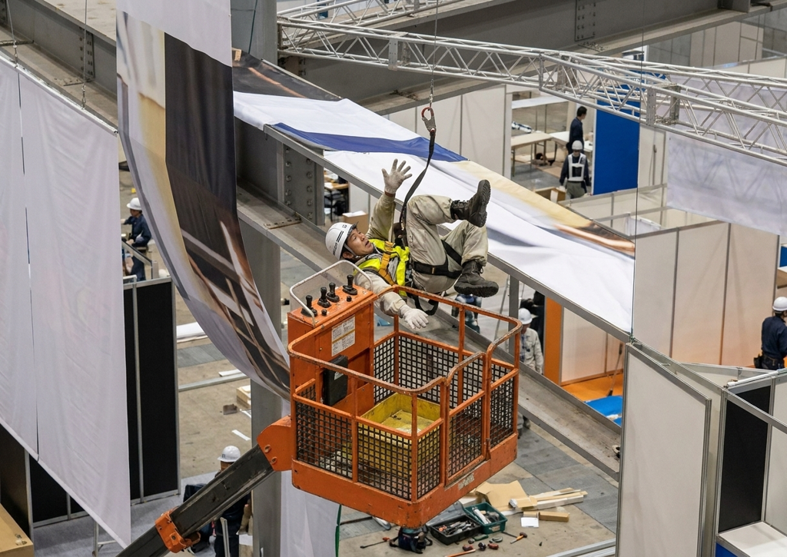
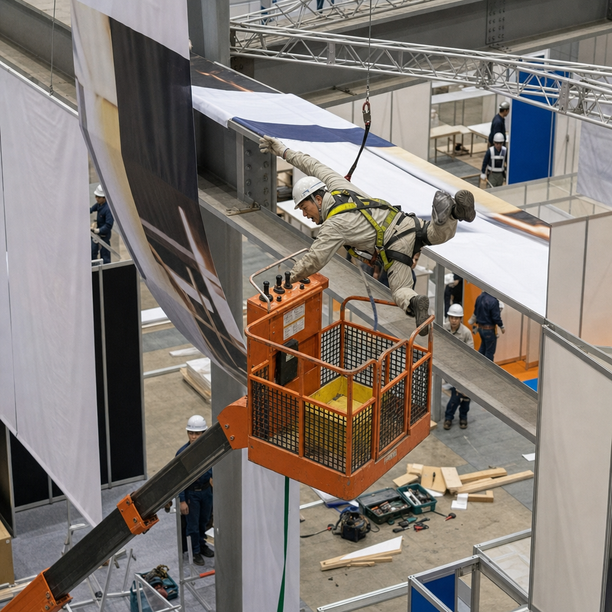
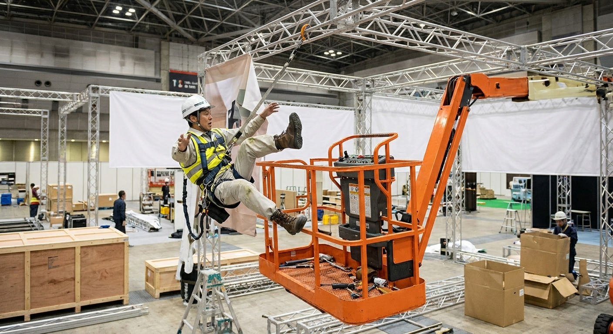

### 前（事故直前） / Phase 1 — Before (lead-up)

**OpenAI Sora 2**

- 【Sora 2／日本語】この画像を開始フレームとして動かす（image-to-video）。ドキュメンタリー調・自然光・手持ちカメラのリアルな実写映像。場面：前（事故直前）。トラス付近で引っ掛かった養生ネット・シートを外そうと、バスケットから手を伸ばしている。作業員は通常どおり準備・作業を進めており、まだ異常は起きていない平穏な場面。 舞台は日本の展示会・イベント設営会場、登場人物は日本人作業員、高所作業車（ブーム式／シザー式・作業床付き）を使用。服装・保護具はあごひも付きヘルメット・ハイビズ（高視認性ベスト）・安全靴・フルハーネス型安全帯。実在ロゴや可読文字は映さない。これは安全教育用の事故再現映像であり、流血・残虐・苦痛の誇張は描かない。約8秒・16:9。
- [Sora 2 / English] Use the provided image as the starting keyframe (image-to-video). Photorealistic documentary footage, natural light, handheld camera. Scene: Phase 1 — Before (lead-up). removing a snagged rigging sheet/net near a truss from an aerial work platform at a venue; workers proceed with the build-up task normally — a calm moment, no incident yet. Set at a Japanese exhibition / event build-up venue with Japanese workers using a Japanese aerial work platform / MEWP (boom or scissor lift with a work basket). Workers wear hard hat with chin strap, hi-vis vest, safety boots, full-body safety harness. No real logos or readable text. This is a safety-education re-enactment; no blood, gore or exaggerated suffering. About 8 seconds, 16:9.

**Google Veo 3.1**

- 【Veo 3.1／日本語】開始キーフレーム＝この画像（image-to-video）。被写体：あごひも付きヘルメット・ハイビズ（高視認性ベスト）・安全靴・フルハーネス型安全帯を着けた日本人作業員と高所作業車（ブーム式／シザー式・作業床付き）。場面：前（事故直前）。アクション：トラス付近で引っ掛かった養生ネット・シートを外そうと、バスケットから手を伸ばしている。作業員は通常どおり準備・作業を進めており、まだ異常は起きていない平穏な場面。 カメラ：ゆっくりとした寄り（緩やかなプッシュイン）／手持ちの微振動。ライティング：会場内の自然な照明。スタイル：リアルなドキュメンタリー写真調、実在ロゴ・可読文字なし。安全教育用の再現であり流血・残虐表現は含めない。約8秒・16:9。
- [Veo 3.1 / English] First keyframe = the provided image (image-to-video). Subject: Japanese workers in hard hat with chin strap, hi-vis vest, safety boots, full-body safety harness with a Japanese aerial work platform / MEWP (boom or scissor lift with a work basket). Scene: Phase 1 — Before (lead-up). Action: removing a snagged rigging sheet/net near a truss from an aerial work platform at a venue; workers proceed with the build-up task normally — a calm moment, no incident yet. Camera: slow push-in with slight handheld motion. Lighting: natural indoor venue light. Style: realistic documentary photography, no real logos or readable text. A safety-education re-enactment with no blood or gore. About 8 seconds, 16:9.

### 事故の瞬間 / Phase 2 — The moment

**OpenAI Sora 2**

- 【Sora 2／日本語】この画像を開始フレームとして動かす（image-to-video）。ドキュメンタリー調・自然光・手持ちカメラのリアルな実写映像。場面：事故の瞬間。バスケットの手すりに足をかけて手を伸ばした際、足を滑らせてバスケットから墜落する瞬間。危険の一瞬を捉える（流血・残虐表現なし）。 舞台は日本の展示会・イベント設営会場、登場人物は日本人作業員、高所作業車（ブーム式／シザー式・作業床付き）を使用。服装・保護具はあごひも付きヘルメット・ハイビズ（高視認性ベスト）・安全靴・フルハーネス型安全帯。実在ロゴや可読文字は映さない。これは安全教育用の事故再現映像であり、流血・残虐・苦痛の誇張は描かない。約8秒・16:9。
- [Sora 2 / English] Use the provided image as the starting keyframe (image-to-video). Photorealistic documentary footage, natural light, handheld camera. Scene: Phase 2 — The moment. reaching to a beam, the worker steps on the basket rail, the foot slips and the worker falls from the basket — capture the dangerous instant (no blood, no gore). Set at a Japanese exhibition / event build-up venue with Japanese workers using a Japanese aerial work platform / MEWP (boom or scissor lift with a work basket). Workers wear hard hat with chin strap, hi-vis vest, safety boots, full-body safety harness. No real logos or readable text. This is a safety-education re-enactment; no blood, gore or exaggerated suffering. About 8 seconds, 16:9.

**Google Veo 3.1**

- 【Veo 3.1／日本語】開始キーフレーム＝この画像（image-to-video）。被写体：あごひも付きヘルメット・ハイビズ（高視認性ベスト）・安全靴・フルハーネス型安全帯を着けた日本人作業員と高所作業車（ブーム式／シザー式・作業床付き）。場面：事故の瞬間。アクション：バスケットの手すりに足をかけて手を伸ばした際、足を滑らせてバスケットから墜落する瞬間。危険の一瞬を捉える（流血・残虐表現なし）。 カメラ：ゆっくりとした寄り（緩やかなプッシュイン）／手持ちの微振動。ライティング：会場内の自然な照明。スタイル：リアルなドキュメンタリー写真調、実在ロゴ・可読文字なし。安全教育用の再現であり流血・残虐表現は含めない。約8秒・16:9。
- [Veo 3.1 / English] First keyframe = the provided image (image-to-video). Subject: Japanese workers in hard hat with chin strap, hi-vis vest, safety boots, full-body safety harness with a Japanese aerial work platform / MEWP (boom or scissor lift with a work basket). Scene: Phase 2 — The moment. Action: reaching to a beam, the worker steps on the basket rail, the foot slips and the worker falls from the basket — capture the dangerous instant (no blood, no gore). Camera: slow push-in with slight handheld motion. Lighting: natural indoor venue light. Style: realistic documentary photography, no real logos or readable text. A safety-education re-enactment with no blood or gore. About 8 seconds, 16:9.

### 後（直後の対応） / Phase 3 — After (response)

**OpenAI Sora 2**

- 【Sora 2／日本語】この画像を開始フレームとして動かす（image-to-video）。ドキュメンタリー調・自然光・手持ちカメラのリアルな実写映像。場面：後（直後の対応）。直ちに作業を中断し、周囲の作業員が駆け寄って安全を確認する。大きな外傷描写はなく、再発防止を促す静かな余韻で終える。 舞台は日本の展示会・イベント設営会場、登場人物は日本人作業員、高所作業車（ブーム式／シザー式・作業床付き）を使用。服装・保護具はあごひも付きヘルメット・ハイビズ（高視認性ベスト）・安全靴・フルハーネス型安全帯。実在ロゴや可読文字は映さない。これは安全教育用の事故再現映像であり、流血・残虐・苦痛の誇張は描かない。約8秒・16:9。
- [Sora 2 / English] Use the provided image as the starting keyframe (image-to-video). Photorealistic documentary footage, natural light, handheld camera. Scene: Phase 3 — After (response). work stops immediately; nearby workers rush in and check on safety. No graphic injury; end on a quiet beat that stresses prevention. Set at a Japanese exhibition / event build-up venue with Japanese workers using a Japanese aerial work platform / MEWP (boom or scissor lift with a work basket). Workers wear hard hat with chin strap, hi-vis vest, safety boots, full-body safety harness. No real logos or readable text. This is a safety-education re-enactment; no blood, gore or exaggerated suffering. About 8 seconds, 16:9.

**Google Veo 3.1**

- 【Veo 3.1／日本語】開始キーフレーム＝この画像（image-to-video）。被写体：あごひも付きヘルメット・ハイビズ（高視認性ベスト）・安全靴・フルハーネス型安全帯を着けた日本人作業員と高所作業車（ブーム式／シザー式・作業床付き）。場面：後（直後の対応）。アクション：直ちに作業を中断し、周囲の作業員が駆け寄って安全を確認する。大きな外傷描写はなく、再発防止を促す静かな余韻で終える。 カメラ：ゆっくりとした寄り（緩やかなプッシュイン）／手持ちの微振動。ライティング：会場内の自然な照明。スタイル：リアルなドキュメンタリー写真調、実在ロゴ・可読文字なし。安全教育用の再現であり流血・残虐表現は含めない。約8秒・16:9。
- [Veo 3.1 / English] First keyframe = the provided image (image-to-video). Subject: Japanese workers in hard hat with chin strap, hi-vis vest, safety boots, full-body safety harness with a Japanese aerial work platform / MEWP (boom or scissor lift with a work basket). Scene: Phase 3 — After (response). Action: work stops immediately; nearby workers rush in and check on safety. No graphic injury; end on a quiet beat that stresses prevention. Camera: slow push-in with slight handheld motion. Lighting: natural indoor venue light. Style: realistic documentary photography, no real logos or readable text. A safety-education re-enactment with no blood or gore. About 8 seconds, 16:9.

---

## 事故事例 N09　看板取付で身を乗り出し、作業床から墜落

- カテゴリ：高所（高所作業車（ブーム式／シザー式・作業床付き））
- 開始フレーム画像：`photos_v16/N09/base.png` ／ `openai.png` ／ `google.png`（3案いずれかを開始/キーフレームに使用）
- 監修：金田 義太（労働安全コンサルタント 登録第4840号）

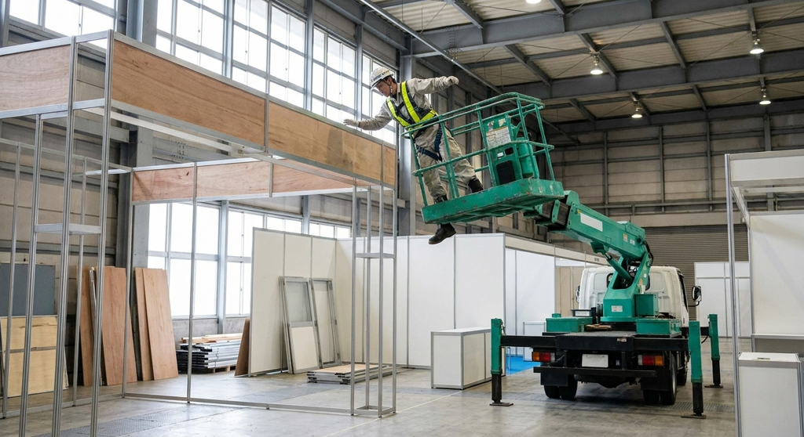
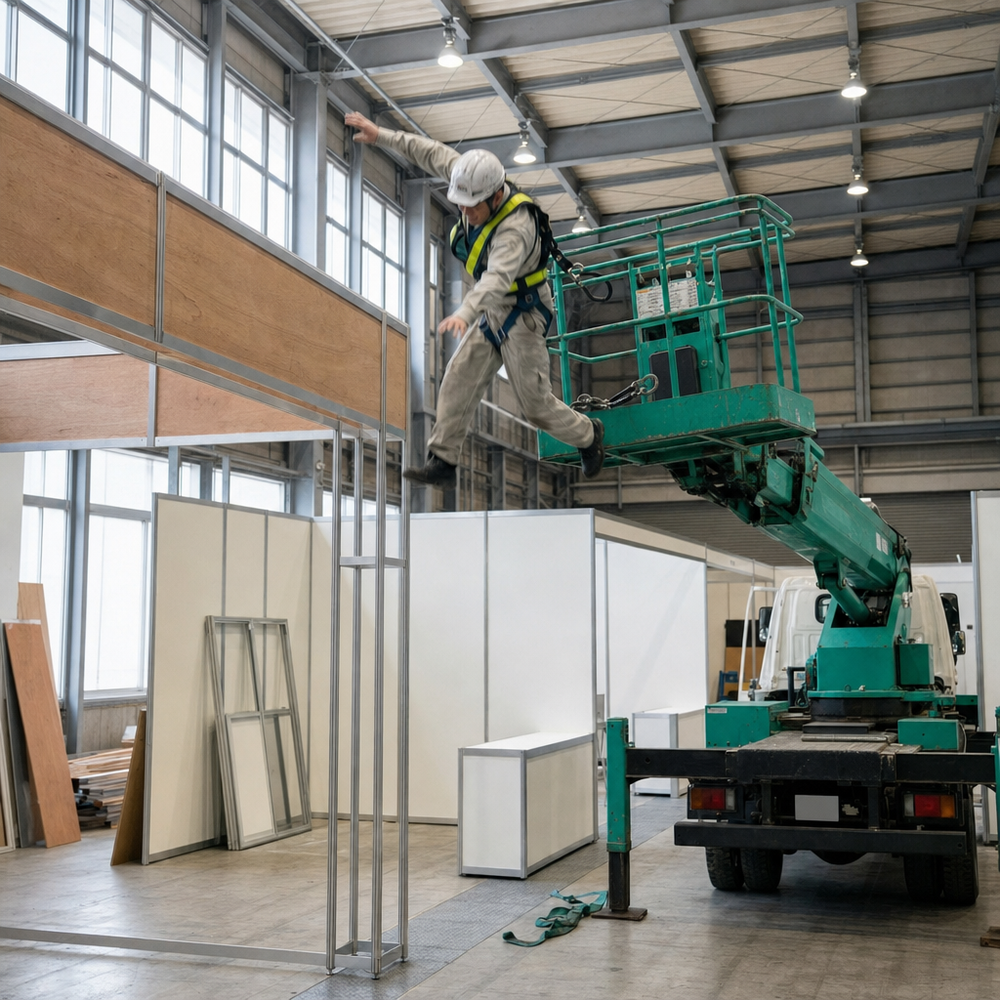
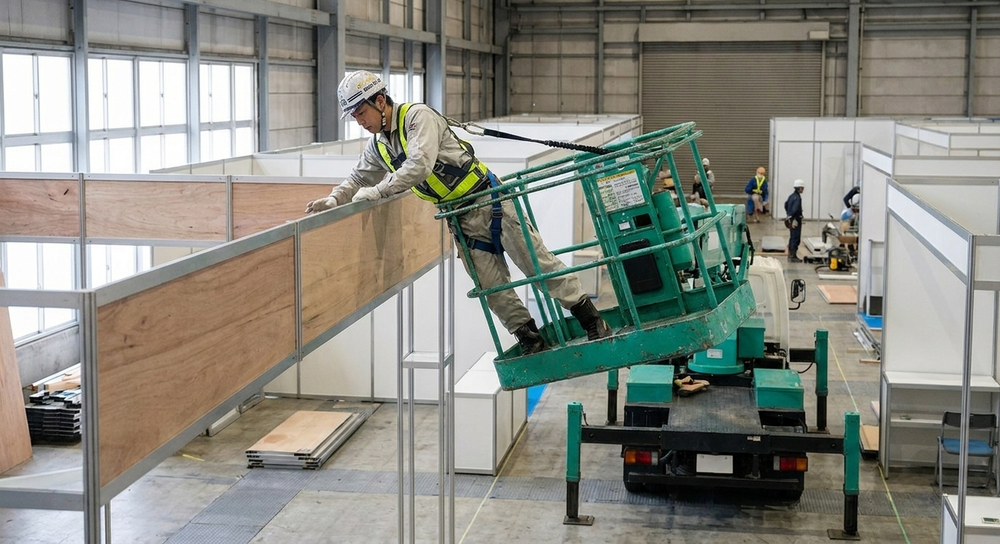

### 前（事故直前） / Phase 1 — Before (lead-up)

**OpenAI Sora 2**

- 【Sora 2／日本語】この画像を開始フレームとして動かす（image-to-video）。ドキュメンタリー調・自然光・手持ちカメラのリアルな実写映像。場面：前（事故直前）。会場の看板・サイン取付作業を、高所作業車の作業床から行っている。作業員は通常どおり準備・作業を進めており、まだ異常は起きていない平穏な場面。 舞台は日本の展示会・イベント設営会場、登場人物は日本人作業員、高所作業車（ブーム式／シザー式・作業床付き）を使用。服装・保護具はあごひも付きヘルメット・ハイビズ（高視認性ベスト）・安全靴・フルハーネス型安全帯。実在ロゴや可読文字は映さない。これは安全教育用の事故再現映像であり、流血・残虐・苦痛の誇張は描かない。約8秒・16:9。
- [Sora 2 / English] Use the provided image as the starting keyframe (image-to-video). Photorealistic documentary footage, natural light, handheld camera. Scene: Phase 1 — Before (lead-up). fixing venue signage while leaning out of an aerial work platform; workers proceed with the build-up task normally — a calm moment, no incident yet. Set at a Japanese exhibition / event build-up venue with Japanese workers using a Japanese aerial work platform / MEWP (boom or scissor lift with a work basket). Workers wear hard hat with chin strap, hi-vis vest, safety boots, full-body safety harness. No real logos or readable text. This is a safety-education re-enactment; no blood, gore or exaggerated suffering. About 8 seconds, 16:9.

**Google Veo 3.1**

- 【Veo 3.1／日本語】開始キーフレーム＝この画像（image-to-video）。被写体：あごひも付きヘルメット・ハイビズ（高視認性ベスト）・安全靴・フルハーネス型安全帯を着けた日本人作業員と高所作業車（ブーム式／シザー式・作業床付き）。場面：前（事故直前）。アクション：会場の看板・サイン取付作業を、高所作業車の作業床から行っている。作業員は通常どおり準備・作業を進めており、まだ異常は起きていない平穏な場面。 カメラ：ゆっくりとした寄り（緩やかなプッシュイン）／手持ちの微振動。ライティング：会場内の自然な照明。スタイル：リアルなドキュメンタリー写真調、実在ロゴ・可読文字なし。安全教育用の再現であり流血・残虐表現は含めない。約8秒・16:9。
- [Veo 3.1 / English] First keyframe = the provided image (image-to-video). Subject: Japanese workers in hard hat with chin strap, hi-vis vest, safety boots, full-body safety harness with a Japanese aerial work platform / MEWP (boom or scissor lift with a work basket). Scene: Phase 1 — Before (lead-up). Action: fixing venue signage while leaning out of an aerial work platform; workers proceed with the build-up task normally — a calm moment, no incident yet. Camera: slow push-in with slight handheld motion. Lighting: natural indoor venue light. Style: realistic documentary photography, no real logos or readable text. A safety-education re-enactment with no blood or gore. About 8 seconds, 16:9.

### 事故の瞬間 / Phase 2 — The moment

**OpenAI Sora 2**

- 【Sora 2／日本語】この画像を開始フレームとして動かす（image-to-video）。ドキュメンタリー調・自然光・手持ちカメラのリアルな実写映像。場面：事故の瞬間。手すりから大きく身を乗り出した作業者がバランスを崩し、作業床から墜落する瞬間。危険の一瞬を捉える（流血・残虐表現なし）。 舞台は日本の展示会・イベント設営会場、登場人物は日本人作業員、高所作業車（ブーム式／シザー式・作業床付き）を使用。服装・保護具はあごひも付きヘルメット・ハイビズ（高視認性ベスト）・安全靴・フルハーネス型安全帯。実在ロゴや可読文字は映さない。これは安全教育用の事故再現映像であり、流血・残虐・苦痛の誇張は描かない。約8秒・16:9。
- [Sora 2 / English] Use the provided image as the starting keyframe (image-to-video). Photorealistic documentary footage, natural light, handheld camera. Scene: Phase 2 — The moment. reaching out and leaning over the guardrail too far, the worker falls from the work floor — capture the dangerous instant (no blood, no gore). Set at a Japanese exhibition / event build-up venue with Japanese workers using a Japanese aerial work platform / MEWP (boom or scissor lift with a work basket). Workers wear hard hat with chin strap, hi-vis vest, safety boots, full-body safety harness. No real logos or readable text. This is a safety-education re-enactment; no blood, gore or exaggerated suffering. About 8 seconds, 16:9.

**Google Veo 3.1**

- 【Veo 3.1／日本語】開始キーフレーム＝この画像（image-to-video）。被写体：あごひも付きヘルメット・ハイビズ（高視認性ベスト）・安全靴・フルハーネス型安全帯を着けた日本人作業員と高所作業車（ブーム式／シザー式・作業床付き）。場面：事故の瞬間。アクション：手すりから大きく身を乗り出した作業者がバランスを崩し、作業床から墜落する瞬間。危険の一瞬を捉える（流血・残虐表現なし）。 カメラ：ゆっくりとした寄り（緩やかなプッシュイン）／手持ちの微振動。ライティング：会場内の自然な照明。スタイル：リアルなドキュメンタリー写真調、実在ロゴ・可読文字なし。安全教育用の再現であり流血・残虐表現は含めない。約8秒・16:9。
- [Veo 3.1 / English] First keyframe = the provided image (image-to-video). Subject: Japanese workers in hard hat with chin strap, hi-vis vest, safety boots, full-body safety harness with a Japanese aerial work platform / MEWP (boom or scissor lift with a work basket). Scene: Phase 2 — The moment. Action: reaching out and leaning over the guardrail too far, the worker falls from the work floor — capture the dangerous instant (no blood, no gore). Camera: slow push-in with slight handheld motion. Lighting: natural indoor venue light. Style: realistic documentary photography, no real logos or readable text. A safety-education re-enactment with no blood or gore. About 8 seconds, 16:9.

### 後（直後の対応） / Phase 3 — After (response)

**OpenAI Sora 2**

- 【Sora 2／日本語】この画像を開始フレームとして動かす（image-to-video）。ドキュメンタリー調・自然光・手持ちカメラのリアルな実写映像。場面：後（直後の対応）。直ちに作業を中断し、周囲の作業員が駆け寄って安全を確認する。大きな外傷描写はなく、再発防止を促す静かな余韻で終える。 舞台は日本の展示会・イベント設営会場、登場人物は日本人作業員、高所作業車（ブーム式／シザー式・作業床付き）を使用。服装・保護具はあごひも付きヘルメット・ハイビズ（高視認性ベスト）・安全靴・フルハーネス型安全帯。実在ロゴや可読文字は映さない。これは安全教育用の事故再現映像であり、流血・残虐・苦痛の誇張は描かない。約8秒・16:9。
- [Sora 2 / English] Use the provided image as the starting keyframe (image-to-video). Photorealistic documentary footage, natural light, handheld camera. Scene: Phase 3 — After (response). work stops immediately; nearby workers rush in and check on safety. No graphic injury; end on a quiet beat that stresses prevention. Set at a Japanese exhibition / event build-up venue with Japanese workers using a Japanese aerial work platform / MEWP (boom or scissor lift with a work basket). Workers wear hard hat with chin strap, hi-vis vest, safety boots, full-body safety harness. No real logos or readable text. This is a safety-education re-enactment; no blood, gore or exaggerated suffering. About 8 seconds, 16:9.

**Google Veo 3.1**

- 【Veo 3.1／日本語】開始キーフレーム＝この画像（image-to-video）。被写体：あごひも付きヘルメット・ハイビズ（高視認性ベスト）・安全靴・フルハーネス型安全帯を着けた日本人作業員と高所作業車（ブーム式／シザー式・作業床付き）。場面：後（直後の対応）。アクション：直ちに作業を中断し、周囲の作業員が駆け寄って安全を確認する。大きな外傷描写はなく、再発防止を促す静かな余韻で終える。 カメラ：ゆっくりとした寄り（緩やかなプッシュイン）／手持ちの微振動。ライティング：会場内の自然な照明。スタイル：リアルなドキュメンタリー写真調、実在ロゴ・可読文字なし。安全教育用の再現であり流血・残虐表現は含めない。約8秒・16:9。
- [Veo 3.1 / English] First keyframe = the provided image (image-to-video). Subject: Japanese workers in hard hat with chin strap, hi-vis vest, safety boots, full-body safety harness with a Japanese aerial work platform / MEWP (boom or scissor lift with a work basket). Scene: Phase 3 — After (response). Action: work stops immediately; nearby workers rush in and check on safety. No graphic injury; end on a quiet beat that stresses prevention. Camera: slow push-in with slight handheld motion. Lighting: natural indoor venue light. Style: realistic documentary photography, no real logos or readable text. A safety-education re-enactment with no blood or gore. About 8 seconds, 16:9.

---

## 事故事例 N10　作業床上昇中、操作盤フレームと天井の間に胸部を挟まれ

- カテゴリ：高所（高所作業車（ブーム式／シザー式・作業床付き））
- 開始フレーム画像：`photos_v16/N10/base.png` ／ `openai.png` ／ `google.png`（3案いずれかを開始/キーフレームに使用）
- 監修：金田 義太（労働安全コンサルタント 登録第4840号）

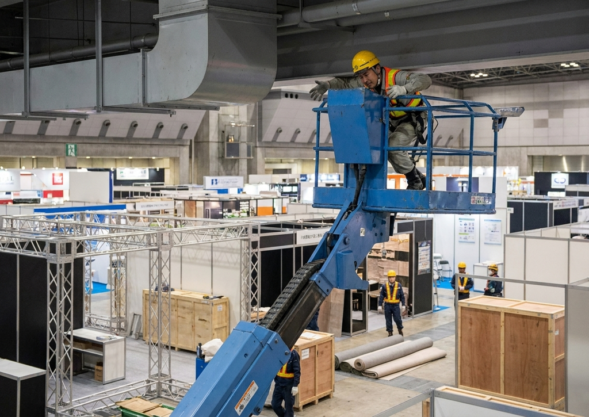
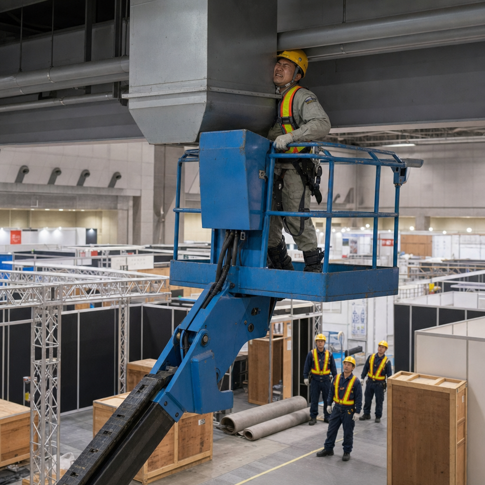
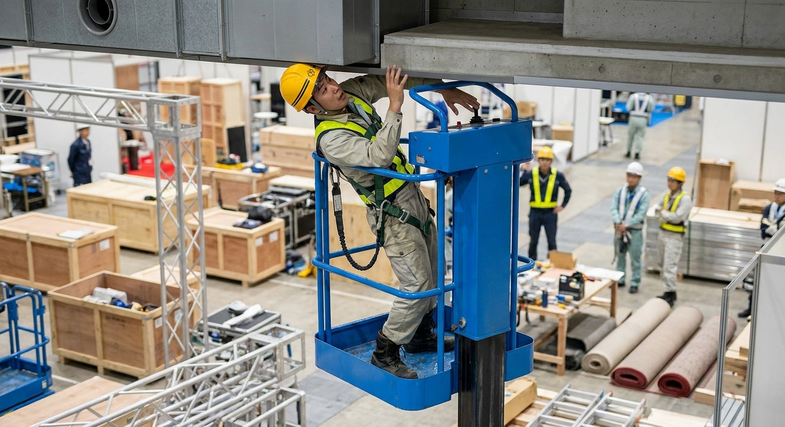

### 前（事故直前） / Phase 1 — Before (lead-up)

**OpenAI Sora 2**

- 【Sora 2／日本語】この画像を開始フレームとして動かす（image-to-video）。ドキュメンタリー調・自然光・手持ちカメラのリアルな実写映像。場面：前（事故直前）。ホールの天井ダクト・照明の取付のため、高所作業車の作業床を上昇させている。作業員は通常どおり準備・作業を進めており、まだ異常は起きていない平穏な場面。 舞台は日本の展示会・イベント設営会場、登場人物は日本人作業員、高所作業車（ブーム式／シザー式・作業床付き）を使用。服装・保護具はあごひも付きヘルメット・ハイビズ（高視認性ベスト）・安全靴・フルハーネス型安全帯。実在ロゴや可読文字は映さない。これは安全教育用の事故再現映像であり、流血・残虐・苦痛の誇張は描かない。約8秒・16:9。
- [Sora 2 / English] Use the provided image as the starting keyframe (image-to-video). Photorealistic documentary footage, natural light, handheld camera. Scene: Phase 1 — Before (lead-up). installing ceiling ductwork/lighting from an aerial work platform at a hall; workers proceed with the build-up task normally — a calm moment, no incident yet. Set at a Japanese exhibition / event build-up venue with Japanese workers using a Japanese aerial work platform / MEWP (boom or scissor lift with a work basket). Workers wear hard hat with chin strap, hi-vis vest, safety boots, full-body safety harness. No real logos or readable text. This is a safety-education re-enactment; no blood, gore or exaggerated suffering. About 8 seconds, 16:9.

**Google Veo 3.1**

- 【Veo 3.1／日本語】開始キーフレーム＝この画像（image-to-video）。被写体：あごひも付きヘルメット・ハイビズ（高視認性ベスト）・安全靴・フルハーネス型安全帯を着けた日本人作業員と高所作業車（ブーム式／シザー式・作業床付き）。場面：前（事故直前）。アクション：ホールの天井ダクト・照明の取付のため、高所作業車の作業床を上昇させている。作業員は通常どおり準備・作業を進めており、まだ異常は起きていない平穏な場面。 カメラ：ゆっくりとした寄り（緩やかなプッシュイン）／手持ちの微振動。ライティング：会場内の自然な照明。スタイル：リアルなドキュメンタリー写真調、実在ロゴ・可読文字なし。安全教育用の再現であり流血・残虐表現は含めない。約8秒・16:9。
- [Veo 3.1 / English] First keyframe = the provided image (image-to-video). Subject: Japanese workers in hard hat with chin strap, hi-vis vest, safety boots, full-body safety harness with a Japanese aerial work platform / MEWP (boom or scissor lift with a work basket). Scene: Phase 1 — Before (lead-up). Action: installing ceiling ductwork/lighting from an aerial work platform at a hall; workers proceed with the build-up task normally — a calm moment, no incident yet. Camera: slow push-in with slight handheld motion. Lighting: natural indoor venue light. Style: realistic documentary photography, no real logos or readable text. A safety-education re-enactment with no blood or gore. About 8 seconds, 16:9.

### 事故の瞬間 / Phase 2 — The moment

**OpenAI Sora 2**

- 【Sora 2／日本語】この画像を開始フレームとして動かす（image-to-video）。ドキュメンタリー調・自然光・手持ちカメラのリアルな実写映像。場面：事故の瞬間。天井の段差に気づかず上昇し、操作盤フレームと天井の間に作業者の胸部が挟まれそうになる瞬間。危険の一瞬を捉える（流血・残虐表現なし）。 舞台は日本の展示会・イベント設営会場、登場人物は日本人作業員、高所作業車（ブーム式／シザー式・作業床付き）を使用。服装・保護具はあごひも付きヘルメット・ハイビズ（高視認性ベスト）・安全靴・フルハーネス型安全帯。実在ロゴや可読文字は映さない。これは安全教育用の事故再現映像であり、流血・残虐・苦痛の誇張は描かない。約8秒・16:9。
- [Sora 2 / English] Use the provided image as the starting keyframe (image-to-video). Photorealistic documentary footage, natural light, handheld camera. Scene: Phase 2 — The moment. raising the platform without noticing a ceiling step, the worker's chest is pinched between the control-panel frame and the ceiling — capture the dangerous instant (no blood, no gore). Set at a Japanese exhibition / event build-up venue with Japanese workers using a Japanese aerial work platform / MEWP (boom or scissor lift with a work basket). Workers wear hard hat with chin strap, hi-vis vest, safety boots, full-body safety harness. No real logos or readable text. This is a safety-education re-enactment; no blood, gore or exaggerated suffering. About 8 seconds, 16:9.

**Google Veo 3.1**

- 【Veo 3.1／日本語】開始キーフレーム＝この画像（image-to-video）。被写体：あごひも付きヘルメット・ハイビズ（高視認性ベスト）・安全靴・フルハーネス型安全帯を着けた日本人作業員と高所作業車（ブーム式／シザー式・作業床付き）。場面：事故の瞬間。アクション：天井の段差に気づかず上昇し、操作盤フレームと天井の間に作業者の胸部が挟まれそうになる瞬間。危険の一瞬を捉える（流血・残虐表現なし）。 カメラ：ゆっくりとした寄り（緩やかなプッシュイン）／手持ちの微振動。ライティング：会場内の自然な照明。スタイル：リアルなドキュメンタリー写真調、実在ロゴ・可読文字なし。安全教育用の再現であり流血・残虐表現は含めない。約8秒・16:9。
- [Veo 3.1 / English] First keyframe = the provided image (image-to-video). Subject: Japanese workers in hard hat with chin strap, hi-vis vest, safety boots, full-body safety harness with a Japanese aerial work platform / MEWP (boom or scissor lift with a work basket). Scene: Phase 2 — The moment. Action: raising the platform without noticing a ceiling step, the worker's chest is pinched between the control-panel frame and the ceiling — capture the dangerous instant (no blood, no gore). Camera: slow push-in with slight handheld motion. Lighting: natural indoor venue light. Style: realistic documentary photography, no real logos or readable text. A safety-education re-enactment with no blood or gore. About 8 seconds, 16:9.

### 後（直後の対応） / Phase 3 — After (response)

**OpenAI Sora 2**

- 【Sora 2／日本語】この画像を開始フレームとして動かす（image-to-video）。ドキュメンタリー調・自然光・手持ちカメラのリアルな実写映像。場面：後（直後の対応）。直ちに作業を中断し、周囲の作業員が駆け寄って安全を確認する。大きな外傷描写はなく、再発防止を促す静かな余韻で終える。 舞台は日本の展示会・イベント設営会場、登場人物は日本人作業員、高所作業車（ブーム式／シザー式・作業床付き）を使用。服装・保護具はあごひも付きヘルメット・ハイビズ（高視認性ベスト）・安全靴・フルハーネス型安全帯。実在ロゴや可読文字は映さない。これは安全教育用の事故再現映像であり、流血・残虐・苦痛の誇張は描かない。約8秒・16:9。
- [Sora 2 / English] Use the provided image as the starting keyframe (image-to-video). Photorealistic documentary footage, natural light, handheld camera. Scene: Phase 3 — After (response). work stops immediately; nearby workers rush in and check on safety. No graphic injury; end on a quiet beat that stresses prevention. Set at a Japanese exhibition / event build-up venue with Japanese workers using a Japanese aerial work platform / MEWP (boom or scissor lift with a work basket). Workers wear hard hat with chin strap, hi-vis vest, safety boots, full-body safety harness. No real logos or readable text. This is a safety-education re-enactment; no blood, gore or exaggerated suffering. About 8 seconds, 16:9.

**Google Veo 3.1**

- 【Veo 3.1／日本語】開始キーフレーム＝この画像（image-to-video）。被写体：あごひも付きヘルメット・ハイビズ（高視認性ベスト）・安全靴・フルハーネス型安全帯を着けた日本人作業員と高所作業車（ブーム式／シザー式・作業床付き）。場面：後（直後の対応）。アクション：直ちに作業を中断し、周囲の作業員が駆け寄って安全を確認する。大きな外傷描写はなく、再発防止を促す静かな余韻で終える。 カメラ：ゆっくりとした寄り（緩やかなプッシュイン）／手持ちの微振動。ライティング：会場内の自然な照明。スタイル：リアルなドキュメンタリー写真調、実在ロゴ・可読文字なし。安全教育用の再現であり流血・残虐表現は含めない。約8秒・16:9。
- [Veo 3.1 / English] First keyframe = the provided image (image-to-video). Subject: Japanese workers in hard hat with chin strap, hi-vis vest, safety boots, full-body safety harness with a Japanese aerial work platform / MEWP (boom or scissor lift with a work basket). Scene: Phase 3 — After (response). Action: work stops immediately; nearby workers rush in and check on safety. No graphic injury; end on a quiet beat that stresses prevention. Camera: slow push-in with slight handheld motion. Lighting: natural indoor venue light. Style: realistic documentary photography, no real logos or readable text. A safety-education re-enactment with no blood or gore. About 8 seconds, 16:9.

---

## 事故事例 N11　バスケットから移ろうとして墜落

- カテゴリ：高所（高所作業車（ブーム式／シザー式・作業床付き））
- 開始フレーム画像：`photos_v16/N11/base.png` ／ `openai.png` ／ `google.png`（3案いずれかを開始/キーフレームに使用）
- 監修：金田 義太（労働安全コンサルタント 登録第4840号）

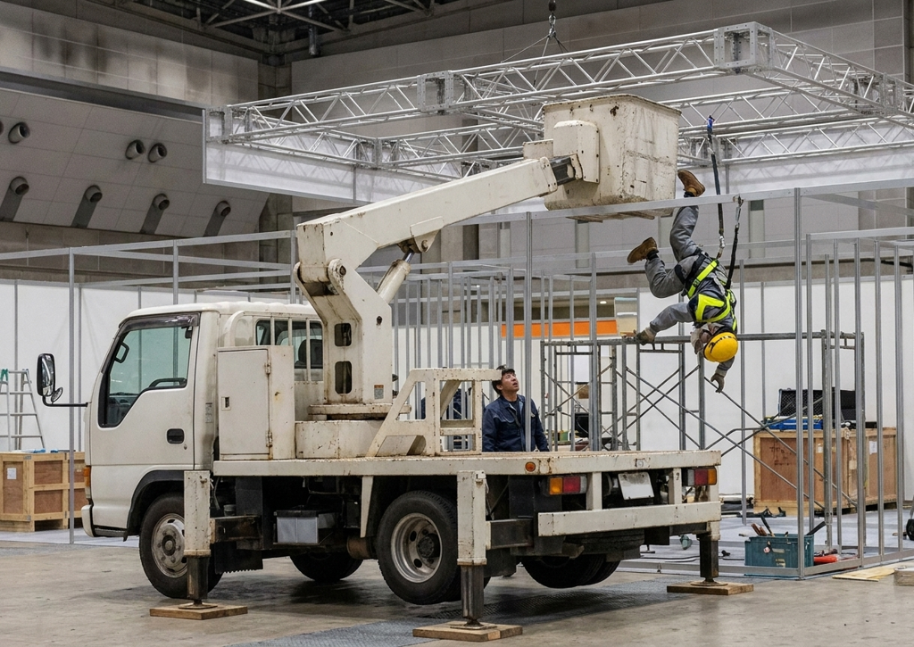
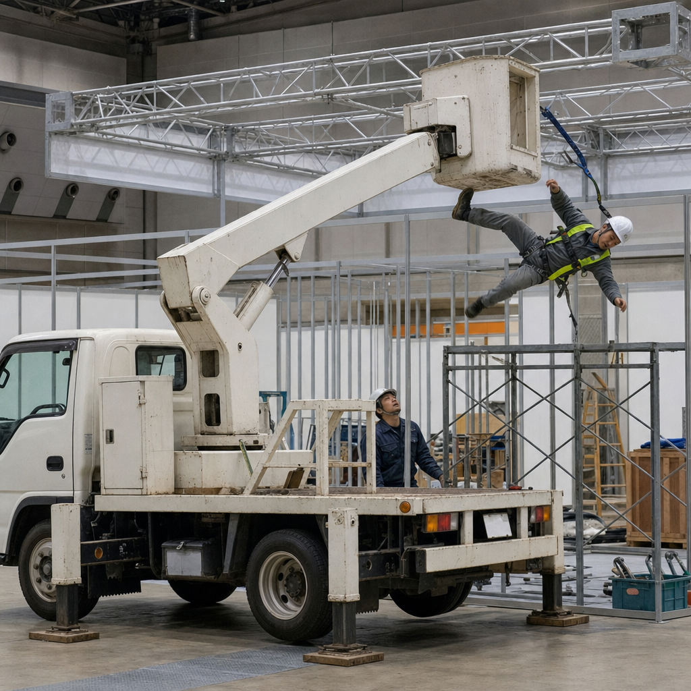
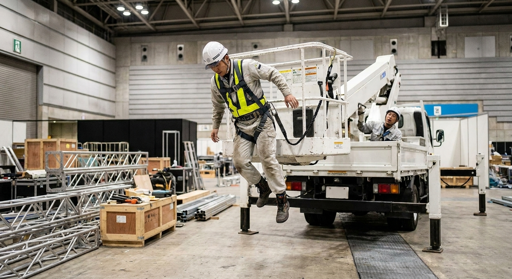

### 前（事故直前） / Phase 1 — Before (lead-up)

**OpenAI Sora 2**

- 【Sora 2／日本語】この画像を開始フレームとして動かす（image-to-video）。ドキュメンタリー調・自然光・手持ちカメラのリアルな実写映像。場面：前（事故直前）。ブース・構造物付近で、高所作業車のバスケットから隣接する構造物へ移ろうとしている。作業員は通常どおり準備・作業を進めており、まだ異常は起きていない平穏な場面。 舞台は日本の展示会・イベント設営会場、登場人物は日本人作業員、高所作業車（ブーム式／シザー式・作業床付き）を使用。服装・保護具はあごひも付きヘルメット・ハイビズ（高視認性ベスト）・安全靴・フルハーネス型安全帯。実在ロゴや可読文字は映さない。これは安全教育用の事故再現映像であり、流血・残虐・苦痛の誇張は描かない。約8秒・16:9。
- [Sora 2 / English] Use the provided image as the starting keyframe (image-to-video). Photorealistic documentary footage, natural light, handheld camera. Scene: Phase 1 — Before (lead-up). transferring from an aerial work platform basket near a booth/structure at a venue; workers proceed with the build-up task normally — a calm moment, no incident yet. Set at a Japanese exhibition / event build-up venue with Japanese workers using a Japanese aerial work platform / MEWP (boom or scissor lift with a work basket). Workers wear hard hat with chin strap, hi-vis vest, safety boots, full-body safety harness. No real logos or readable text. This is a safety-education re-enactment; no blood, gore or exaggerated suffering. About 8 seconds, 16:9.

**Google Veo 3.1**

- 【Veo 3.1／日本語】開始キーフレーム＝この画像（image-to-video）。被写体：あごひも付きヘルメット・ハイビズ（高視認性ベスト）・安全靴・フルハーネス型安全帯を着けた日本人作業員と高所作業車（ブーム式／シザー式・作業床付き）。場面：前（事故直前）。アクション：ブース・構造物付近で、高所作業車のバスケットから隣接する構造物へ移ろうとしている。作業員は通常どおり準備・作業を進めており、まだ異常は起きていない平穏な場面。 カメラ：ゆっくりとした寄り（緩やかなプッシュイン）／手持ちの微振動。ライティング：会場内の自然な照明。スタイル：リアルなドキュメンタリー写真調、実在ロゴ・可読文字なし。安全教育用の再現であり流血・残虐表現は含めない。約8秒・16:9。
- [Veo 3.1 / English] First keyframe = the provided image (image-to-video). Subject: Japanese workers in hard hat with chin strap, hi-vis vest, safety boots, full-body safety harness with a Japanese aerial work platform / MEWP (boom or scissor lift with a work basket). Scene: Phase 1 — Before (lead-up). Action: transferring from an aerial work platform basket near a booth/structure at a venue; workers proceed with the build-up task normally — a calm moment, no incident yet. Camera: slow push-in with slight handheld motion. Lighting: natural indoor venue light. Style: realistic documentary photography, no real logos or readable text. A safety-education re-enactment with no blood or gore. About 8 seconds, 16:9.

### 事故の瞬間 / Phase 2 — The moment

**OpenAI Sora 2**

- 【Sora 2／日本語】この画像を開始フレームとして動かす（image-to-video）。ドキュメンタリー調・自然光・手持ちカメラのリアルな実写映像。場面：事故の瞬間。バスケットから移ろうとして足を踏み外し、数メートル下の地面へ墜落する瞬間。危険の一瞬を捉える（流血・残虐表現なし）。 舞台は日本の展示会・イベント設営会場、登場人物は日本人作業員、高所作業車（ブーム式／シザー式・作業床付き）を使用。服装・保護具はあごひも付きヘルメット・ハイビズ（高視認性ベスト）・安全靴・フルハーネス型安全帯。実在ロゴや可読文字は映さない。これは安全教育用の事故再現映像であり、流血・残虐・苦痛の誇張は描かない。約8秒・16:9。
- [Sora 2 / English] Use the provided image as the starting keyframe (image-to-video). Photorealistic documentary footage, natural light, handheld camera. Scene: Phase 2 — The moment. trying to transfer from the basket to an adjacent structure, the worker falls a few meters to the ground — capture the dangerous instant (no blood, no gore). Set at a Japanese exhibition / event build-up venue with Japanese workers using a Japanese aerial work platform / MEWP (boom or scissor lift with a work basket). Workers wear hard hat with chin strap, hi-vis vest, safety boots, full-body safety harness. No real logos or readable text. This is a safety-education re-enactment; no blood, gore or exaggerated suffering. About 8 seconds, 16:9.

**Google Veo 3.1**

- 【Veo 3.1／日本語】開始キーフレーム＝この画像（image-to-video）。被写体：あごひも付きヘルメット・ハイビズ（高視認性ベスト）・安全靴・フルハーネス型安全帯を着けた日本人作業員と高所作業車（ブーム式／シザー式・作業床付き）。場面：事故の瞬間。アクション：バスケットから移ろうとして足を踏み外し、数メートル下の地面へ墜落する瞬間。危険の一瞬を捉える（流血・残虐表現なし）。 カメラ：ゆっくりとした寄り（緩やかなプッシュイン）／手持ちの微振動。ライティング：会場内の自然な照明。スタイル：リアルなドキュメンタリー写真調、実在ロゴ・可読文字なし。安全教育用の再現であり流血・残虐表現は含めない。約8秒・16:9。
- [Veo 3.1 / English] First keyframe = the provided image (image-to-video). Subject: Japanese workers in hard hat with chin strap, hi-vis vest, safety boots, full-body safety harness with a Japanese aerial work platform / MEWP (boom or scissor lift with a work basket). Scene: Phase 2 — The moment. Action: trying to transfer from the basket to an adjacent structure, the worker falls a few meters to the ground — capture the dangerous instant (no blood, no gore). Camera: slow push-in with slight handheld motion. Lighting: natural indoor venue light. Style: realistic documentary photography, no real logos or readable text. A safety-education re-enactment with no blood or gore. About 8 seconds, 16:9.

### 後（直後の対応） / Phase 3 — After (response)

**OpenAI Sora 2**

- 【Sora 2／日本語】この画像を開始フレームとして動かす（image-to-video）。ドキュメンタリー調・自然光・手持ちカメラのリアルな実写映像。場面：後（直後の対応）。直ちに作業を中断し、周囲の作業員が駆け寄って安全を確認する。大きな外傷描写はなく、再発防止を促す静かな余韻で終える。 舞台は日本の展示会・イベント設営会場、登場人物は日本人作業員、高所作業車（ブーム式／シザー式・作業床付き）を使用。服装・保護具はあごひも付きヘルメット・ハイビズ（高視認性ベスト）・安全靴・フルハーネス型安全帯。実在ロゴや可読文字は映さない。これは安全教育用の事故再現映像であり、流血・残虐・苦痛の誇張は描かない。約8秒・16:9。
- [Sora 2 / English] Use the provided image as the starting keyframe (image-to-video). Photorealistic documentary footage, natural light, handheld camera. Scene: Phase 3 — After (response). work stops immediately; nearby workers rush in and check on safety. No graphic injury; end on a quiet beat that stresses prevention. Set at a Japanese exhibition / event build-up venue with Japanese workers using a Japanese aerial work platform / MEWP (boom or scissor lift with a work basket). Workers wear hard hat with chin strap, hi-vis vest, safety boots, full-body safety harness. No real logos or readable text. This is a safety-education re-enactment; no blood, gore or exaggerated suffering. About 8 seconds, 16:9.

**Google Veo 3.1**

- 【Veo 3.1／日本語】開始キーフレーム＝この画像（image-to-video）。被写体：あごひも付きヘルメット・ハイビズ（高視認性ベスト）・安全靴・フルハーネス型安全帯を着けた日本人作業員と高所作業車（ブーム式／シザー式・作業床付き）。場面：後（直後の対応）。アクション：直ちに作業を中断し、周囲の作業員が駆け寄って安全を確認する。大きな外傷描写はなく、再発防止を促す静かな余韻で終える。 カメラ：ゆっくりとした寄り（緩やかなプッシュイン）／手持ちの微振動。ライティング：会場内の自然な照明。スタイル：リアルなドキュメンタリー写真調、実在ロゴ・可読文字なし。安全教育用の再現であり流血・残虐表現は含めない。約8秒・16:9。
- [Veo 3.1 / English] First keyframe = the provided image (image-to-video). Subject: Japanese workers in hard hat with chin strap, hi-vis vest, safety boots, full-body safety harness with a Japanese aerial work platform / MEWP (boom or scissor lift with a work basket). Scene: Phase 3 — After (response). Action: work stops immediately; nearby workers rush in and check on safety. No graphic injury; end on a quiet beat that stresses prevention. Camera: slow push-in with slight handheld motion. Lighting: natural indoor venue light. Style: realistic documentary photography, no real logos or readable text. A safety-education re-enactment with no blood or gore. About 8 seconds, 16:9.

---

## 事故事例 N12　傾斜地で旋回中、機体がバランスを崩し転倒

- カテゴリ：高所（高所作業車（ブーム式／シザー式・作業床付き））
- 開始フレーム画像：`photos_v16/N12/base.png` ／ `openai.png` ／ `google.png`（3案いずれかを開始/キーフレームに使用）
- 監修：金田 義太（労働安全コンサルタント 登録第4840号）

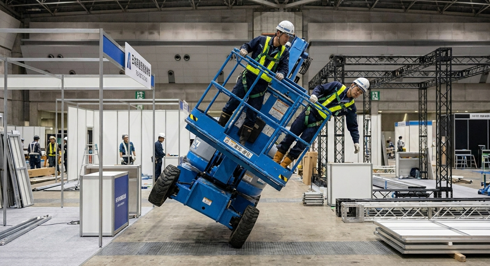
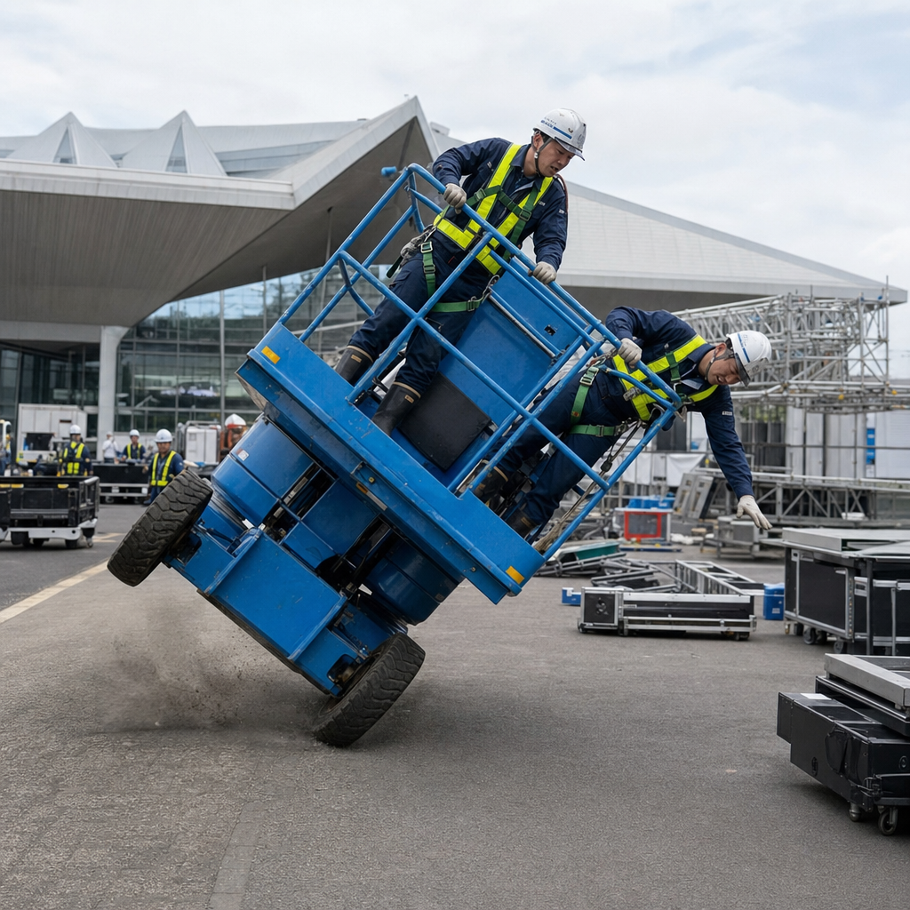
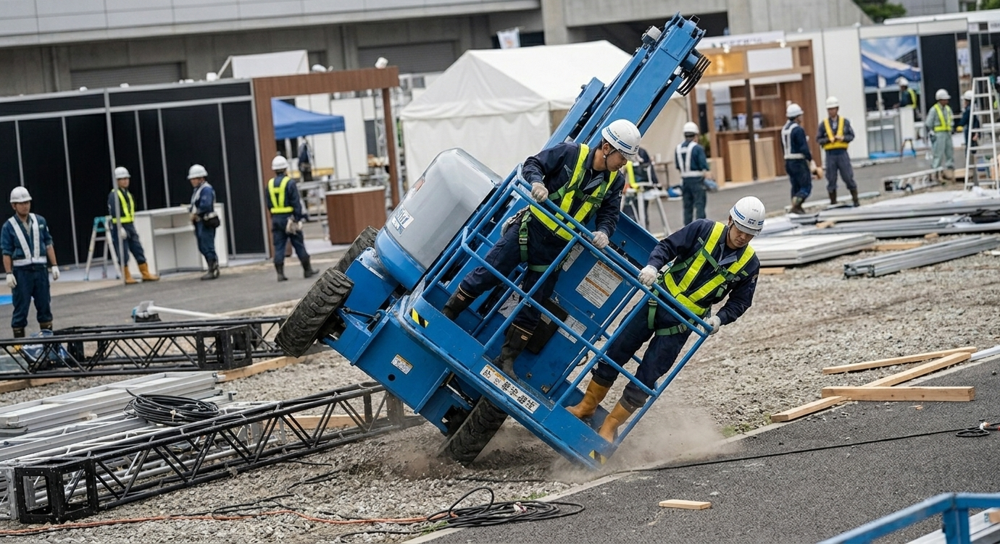

### 前（事故直前） / Phase 1 — Before (lead-up)

**OpenAI Sora 2**

- 【Sora 2／日本語】この画像を開始フレームとして動かす（image-to-video）。ドキュメンタリー調・自然光・手持ちカメラのリアルな実写映像。場面：前（事故直前）。屋外会場の傾斜地で、高所作業車のブームを旋回させている。作業員は通常どおり準備・作業を進めており、まだ異常は起きていない平穏な場面。 舞台は日本の展示会・イベント設営会場、登場人物は日本人作業員、高所作業車（ブーム式／シザー式・作業床付き）を使用。服装・保護具はあごひも付きヘルメット・ハイビズ（高視認性ベスト）・安全靴・フルハーネス型安全帯。実在ロゴや可読文字は映さない。これは安全教育用の事故再現映像であり、流血・残虐・苦痛の誇張は描かない。約8秒・16:9。
- [Sora 2 / English] Use the provided image as the starting keyframe (image-to-video). Photorealistic documentary footage, natural light, handheld camera. Scene: Phase 1 — Before (lead-up). outdoor venue ground; an aerial work platform slewing on a slope; workers proceed with the build-up task normally — a calm moment, no incident yet. Set at a Japanese exhibition / event build-up venue with Japanese workers using a Japanese aerial work platform / MEWP (boom or scissor lift with a work basket). Workers wear hard hat with chin strap, hi-vis vest, safety boots, full-body safety harness. No real logos or readable text. This is a safety-education re-enactment; no blood, gore or exaggerated suffering. About 8 seconds, 16:9.

**Google Veo 3.1**

- 【Veo 3.1／日本語】開始キーフレーム＝この画像（image-to-video）。被写体：あごひも付きヘルメット・ハイビズ（高視認性ベスト）・安全靴・フルハーネス型安全帯を着けた日本人作業員と高所作業車（ブーム式／シザー式・作業床付き）。場面：前（事故直前）。アクション：屋外会場の傾斜地で、高所作業車のブームを旋回させている。作業員は通常どおり準備・作業を進めており、まだ異常は起きていない平穏な場面。 カメラ：ゆっくりとした寄り（緩やかなプッシュイン）／手持ちの微振動。ライティング：会場内の自然な照明。スタイル：リアルなドキュメンタリー写真調、実在ロゴ・可読文字なし。安全教育用の再現であり流血・残虐表現は含めない。約8秒・16:9。
- [Veo 3.1 / English] First keyframe = the provided image (image-to-video). Subject: Japanese workers in hard hat with chin strap, hi-vis vest, safety boots, full-body safety harness with a Japanese aerial work platform / MEWP (boom or scissor lift with a work basket). Scene: Phase 1 — Before (lead-up). Action: outdoor venue ground; an aerial work platform slewing on a slope; workers proceed with the build-up task normally — a calm moment, no incident yet. Camera: slow push-in with slight handheld motion. Lighting: natural indoor venue light. Style: realistic documentary photography, no real logos or readable text. A safety-education re-enactment with no blood or gore. About 8 seconds, 16:9.

### 事故の瞬間 / Phase 2 — The moment

**OpenAI Sora 2**

- 【Sora 2／日本語】この画像を開始フレームとして動かす（image-to-video）。ドキュメンタリー調・自然光・手持ちカメラのリアルな実写映像。場面：事故の瞬間。傾斜地で左へ旋回した際、機体がバランスを崩して転倒する瞬間。危険の一瞬を捉える（流血・残虐表現なし）。 舞台は日本の展示会・イベント設営会場、登場人物は日本人作業員、高所作業車（ブーム式／シザー式・作業床付き）を使用。服装・保護具はあごひも付きヘルメット・ハイビズ（高視認性ベスト）・安全靴・フルハーネス型安全帯。実在ロゴや可読文字は映さない。これは安全教育用の事故再現映像であり、流血・残虐・苦痛の誇張は描かない。約8秒・16:9。
- [Sora 2 / English] Use the provided image as the starting keyframe (image-to-video). Photorealistic documentary footage, natural light, handheld camera. Scene: Phase 2 — The moment. on sloped ground, swinging the boom left, the machine loses balance and the whole platform tips over — capture the dangerous instant (no blood, no gore). Set at a Japanese exhibition / event build-up venue with Japanese workers using a Japanese aerial work platform / MEWP (boom or scissor lift with a work basket). Workers wear hard hat with chin strap, hi-vis vest, safety boots, full-body safety harness. No real logos or readable text. This is a safety-education re-enactment; no blood, gore or exaggerated suffering. About 8 seconds, 16:9.

**Google Veo 3.1**

- 【Veo 3.1／日本語】開始キーフレーム＝この画像（image-to-video）。被写体：あごひも付きヘルメット・ハイビズ（高視認性ベスト）・安全靴・フルハーネス型安全帯を着けた日本人作業員と高所作業車（ブーム式／シザー式・作業床付き）。場面：事故の瞬間。アクション：傾斜地で左へ旋回した際、機体がバランスを崩して転倒する瞬間。危険の一瞬を捉える（流血・残虐表現なし）。 カメラ：ゆっくりとした寄り（緩やかなプッシュイン）／手持ちの微振動。ライティング：会場内の自然な照明。スタイル：リアルなドキュメンタリー写真調、実在ロゴ・可読文字なし。安全教育用の再現であり流血・残虐表現は含めない。約8秒・16:9。
- [Veo 3.1 / English] First keyframe = the provided image (image-to-video). Subject: Japanese workers in hard hat with chin strap, hi-vis vest, safety boots, full-body safety harness with a Japanese aerial work platform / MEWP (boom or scissor lift with a work basket). Scene: Phase 2 — The moment. Action: on sloped ground, swinging the boom left, the machine loses balance and the whole platform tips over — capture the dangerous instant (no blood, no gore). Camera: slow push-in with slight handheld motion. Lighting: natural indoor venue light. Style: realistic documentary photography, no real logos or readable text. A safety-education re-enactment with no blood or gore. About 8 seconds, 16:9.

### 後（直後の対応） / Phase 3 — After (response)

**OpenAI Sora 2**

- 【Sora 2／日本語】この画像を開始フレームとして動かす（image-to-video）。ドキュメンタリー調・自然光・手持ちカメラのリアルな実写映像。場面：後（直後の対応）。直ちに作業を中断し、周囲の作業員が駆け寄って安全を確認する。大きな外傷描写はなく、再発防止を促す静かな余韻で終える。 舞台は日本の展示会・イベント設営会場、登場人物は日本人作業員、高所作業車（ブーム式／シザー式・作業床付き）を使用。服装・保護具はあごひも付きヘルメット・ハイビズ（高視認性ベスト）・安全靴・フルハーネス型安全帯。実在ロゴや可読文字は映さない。これは安全教育用の事故再現映像であり、流血・残虐・苦痛の誇張は描かない。約8秒・16:9。
- [Sora 2 / English] Use the provided image as the starting keyframe (image-to-video). Photorealistic documentary footage, natural light, handheld camera. Scene: Phase 3 — After (response). work stops immediately; nearby workers rush in and check on safety. No graphic injury; end on a quiet beat that stresses prevention. Set at a Japanese exhibition / event build-up venue with Japanese workers using a Japanese aerial work platform / MEWP (boom or scissor lift with a work basket). Workers wear hard hat with chin strap, hi-vis vest, safety boots, full-body safety harness. No real logos or readable text. This is a safety-education re-enactment; no blood, gore or exaggerated suffering. About 8 seconds, 16:9.

**Google Veo 3.1**

- 【Veo 3.1／日本語】開始キーフレーム＝この画像（image-to-video）。被写体：あごひも付きヘルメット・ハイビズ（高視認性ベスト）・安全靴・フルハーネス型安全帯を着けた日本人作業員と高所作業車（ブーム式／シザー式・作業床付き）。場面：後（直後の対応）。アクション：直ちに作業を中断し、周囲の作業員が駆け寄って安全を確認する。大きな外傷描写はなく、再発防止を促す静かな余韻で終える。 カメラ：ゆっくりとした寄り（緩やかなプッシュイン）／手持ちの微振動。ライティング：会場内の自然な照明。スタイル：リアルなドキュメンタリー写真調、実在ロゴ・可読文字なし。安全教育用の再現であり流血・残虐表現は含めない。約8秒・16:9。
- [Veo 3.1 / English] First keyframe = the provided image (image-to-video). Subject: Japanese workers in hard hat with chin strap, hi-vis vest, safety boots, full-body safety harness with a Japanese aerial work platform / MEWP (boom or scissor lift with a work basket). Scene: Phase 3 — After (response). Action: work stops immediately; nearby workers rush in and check on safety. No graphic injury; end on a quiet beat that stresses prevention. Camera: slow push-in with slight handheld motion. Lighting: natural indoor venue light. Style: realistic documentary photography, no real logos or readable text. A safety-education re-enactment with no blood or gore. About 8 seconds, 16:9.

---

## 事故事例 N13　手すりに足をかけたダクト取付中に墜落

- カテゴリ：高所（高所作業車（ブーム式／シザー式・作業床付き））
- 開始フレーム画像：`photos_v16/N13/base.png` ／ `openai.png` ／ `google.png`（3案いずれかを開始/キーフレームに使用）
- 監修：金田 義太（労働安全コンサルタント 登録第4840号）

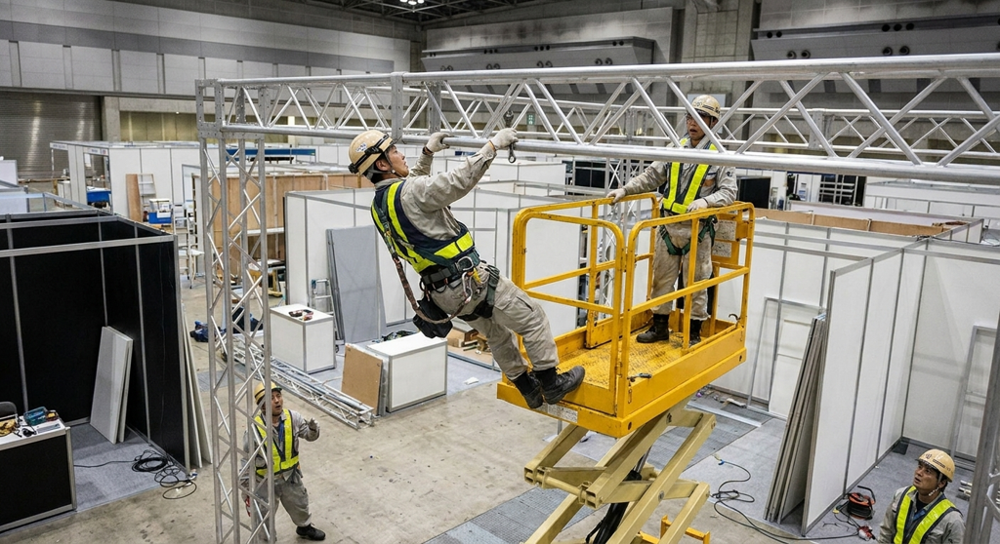
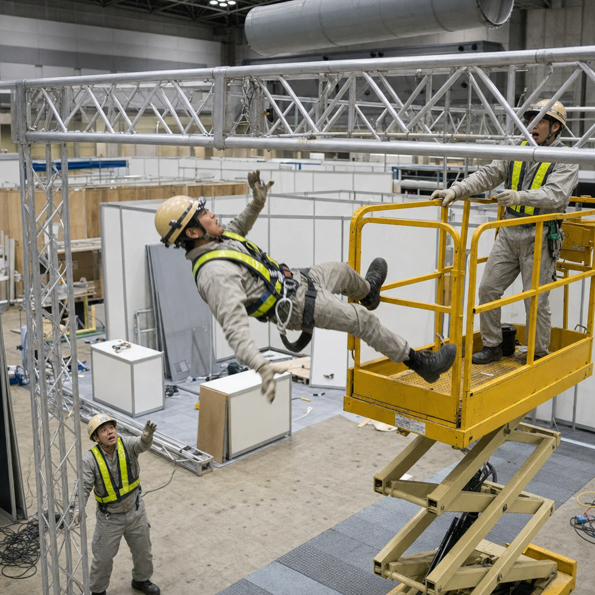
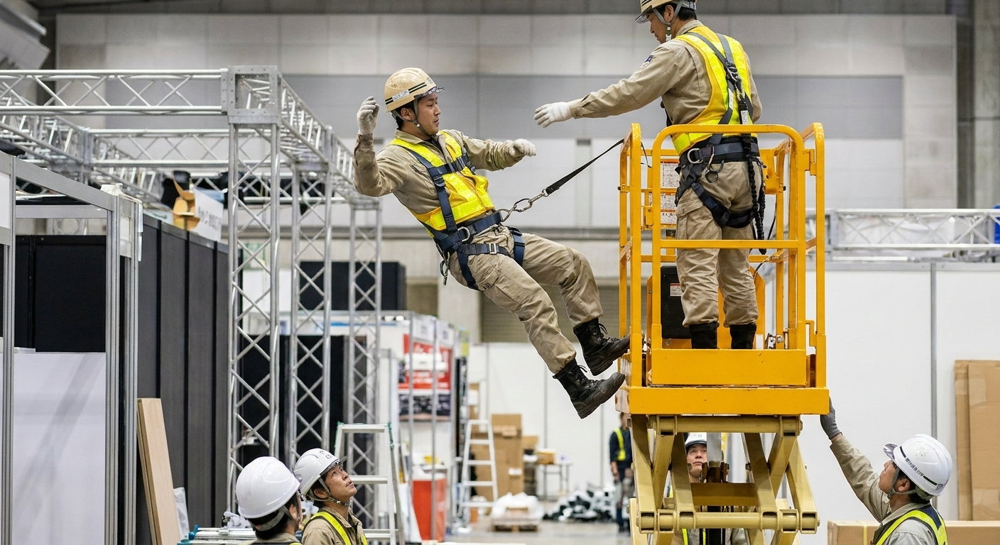

### 前（事故直前） / Phase 1 — Before (lead-up)

**OpenAI Sora 2**

- 【Sora 2／日本語】この画像を開始フレームとして動かす（image-to-video）。ドキュメンタリー調・自然光・手持ちカメラのリアルな実写映像。場面：前（事故直前）。会場天井のダクト・機材の取付を、高所作業車のバスケットから行っている。作業員は通常どおり準備・作業を進めており、まだ異常は起きていない平穏な場面。 舞台は日本の展示会・イベント設営会場、登場人物は日本人作業員、高所作業車（ブーム式／シザー式・作業床付き）を使用。服装・保護具はあごひも付きヘルメット・ハイビズ（高視認性ベスト）・安全靴・フルハーネス型安全帯。実在ロゴや可読文字は映さない。これは安全教育用の事故再現映像であり、流血・残虐・苦痛の誇張は描かない。約8秒・16:9。
- [Sora 2 / English] Use the provided image as the starting keyframe (image-to-video). Photorealistic documentary footage, natural light, handheld camera. Scene: Phase 1 — Before (lead-up). installing ceiling ducts/equipment from an aerial work platform at a venue; workers proceed with the build-up task normally — a calm moment, no incident yet. Set at a Japanese exhibition / event build-up venue with Japanese workers using a Japanese aerial work platform / MEWP (boom or scissor lift with a work basket). Workers wear hard hat with chin strap, hi-vis vest, safety boots, full-body safety harness. No real logos or readable text. This is a safety-education re-enactment; no blood, gore or exaggerated suffering. About 8 seconds, 16:9.

**Google Veo 3.1**

- 【Veo 3.1／日本語】開始キーフレーム＝この画像（image-to-video）。被写体：あごひも付きヘルメット・ハイビズ（高視認性ベスト）・安全靴・フルハーネス型安全帯を着けた日本人作業員と高所作業車（ブーム式／シザー式・作業床付き）。場面：前（事故直前）。アクション：会場天井のダクト・機材の取付を、高所作業車のバスケットから行っている。作業員は通常どおり準備・作業を進めており、まだ異常は起きていない平穏な場面。 カメラ：ゆっくりとした寄り（緩やかなプッシュイン）／手持ちの微振動。ライティング：会場内の自然な照明。スタイル：リアルなドキュメンタリー写真調、実在ロゴ・可読文字なし。安全教育用の再現であり流血・残虐表現は含めない。約8秒・16:9。
- [Veo 3.1 / English] First keyframe = the provided image (image-to-video). Subject: Japanese workers in hard hat with chin strap, hi-vis vest, safety boots, full-body safety harness with a Japanese aerial work platform / MEWP (boom or scissor lift with a work basket). Scene: Phase 1 — Before (lead-up). Action: installing ceiling ducts/equipment from an aerial work platform at a venue; workers proceed with the build-up task normally — a calm moment, no incident yet. Camera: slow push-in with slight handheld motion. Lighting: natural indoor venue light. Style: realistic documentary photography, no real logos or readable text. A safety-education re-enactment with no blood or gore. About 8 seconds, 16:9.

### 事故の瞬間 / Phase 2 — The moment

**OpenAI Sora 2**

- 【Sora 2／日本語】この画像を開始フレームとして動かす（image-to-video）。ドキュメンタリー調・自然光・手持ちカメラのリアルな実写映像。場面：事故の瞬間。バスケットの手すりに足をかけた状態でバランスを崩し、作業床から墜落する瞬間。危険の一瞬を捉える（流血・残虐表現なし）。 舞台は日本の展示会・イベント設営会場、登場人物は日本人作業員、高所作業車（ブーム式／シザー式・作業床付き）を使用。服装・保護具はあごひも付きヘルメット・ハイビズ（高視認性ベスト）・安全靴・フルハーネス型安全帯。実在ロゴや可読文字は映さない。これは安全教育用の事故再現映像であり、流血・残虐・苦痛の誇張は描かない。約8秒・16:9。
- [Sora 2 / English] Use the provided image as the starting keyframe (image-to-video). Photorealistic documentary footage, natural light, handheld camera. Scene: Phase 2 — The moment. with a foot on the basket guardrail during overhead duct fixing, the worker loses balance and falls from the platform — capture the dangerous instant (no blood, no gore). Set at a Japanese exhibition / event build-up venue with Japanese workers using a Japanese aerial work platform / MEWP (boom or scissor lift with a work basket). Workers wear hard hat with chin strap, hi-vis vest, safety boots, full-body safety harness. No real logos or readable text. This is a safety-education re-enactment; no blood, gore or exaggerated suffering. About 8 seconds, 16:9.

**Google Veo 3.1**

- 【Veo 3.1／日本語】開始キーフレーム＝この画像（image-to-video）。被写体：あごひも付きヘルメット・ハイビズ（高視認性ベスト）・安全靴・フルハーネス型安全帯を着けた日本人作業員と高所作業車（ブーム式／シザー式・作業床付き）。場面：事故の瞬間。アクション：バスケットの手すりに足をかけた状態でバランスを崩し、作業床から墜落する瞬間。危険の一瞬を捉える（流血・残虐表現なし）。 カメラ：ゆっくりとした寄り（緩やかなプッシュイン）／手持ちの微振動。ライティング：会場内の自然な照明。スタイル：リアルなドキュメンタリー写真調、実在ロゴ・可読文字なし。安全教育用の再現であり流血・残虐表現は含めない。約8秒・16:9。
- [Veo 3.1 / English] First keyframe = the provided image (image-to-video). Subject: Japanese workers in hard hat with chin strap, hi-vis vest, safety boots, full-body safety harness with a Japanese aerial work platform / MEWP (boom or scissor lift with a work basket). Scene: Phase 2 — The moment. Action: with a foot on the basket guardrail during overhead duct fixing, the worker loses balance and falls from the platform — capture the dangerous instant (no blood, no gore). Camera: slow push-in with slight handheld motion. Lighting: natural indoor venue light. Style: realistic documentary photography, no real logos or readable text. A safety-education re-enactment with no blood or gore. About 8 seconds, 16:9.

### 後（直後の対応） / Phase 3 — After (response)

**OpenAI Sora 2**

- 【Sora 2／日本語】この画像を開始フレームとして動かす（image-to-video）。ドキュメンタリー調・自然光・手持ちカメラのリアルな実写映像。場面：後（直後の対応）。直ちに作業を中断し、周囲の作業員が駆け寄って安全を確認する。大きな外傷描写はなく、再発防止を促す静かな余韻で終える。 舞台は日本の展示会・イベント設営会場、登場人物は日本人作業員、高所作業車（ブーム式／シザー式・作業床付き）を使用。服装・保護具はあごひも付きヘルメット・ハイビズ（高視認性ベスト）・安全靴・フルハーネス型安全帯。実在ロゴや可読文字は映さない。これは安全教育用の事故再現映像であり、流血・残虐・苦痛の誇張は描かない。約8秒・16:9。
- [Sora 2 / English] Use the provided image as the starting keyframe (image-to-video). Photorealistic documentary footage, natural light, handheld camera. Scene: Phase 3 — After (response). work stops immediately; nearby workers rush in and check on safety. No graphic injury; end on a quiet beat that stresses prevention. Set at a Japanese exhibition / event build-up venue with Japanese workers using a Japanese aerial work platform / MEWP (boom or scissor lift with a work basket). Workers wear hard hat with chin strap, hi-vis vest, safety boots, full-body safety harness. No real logos or readable text. This is a safety-education re-enactment; no blood, gore or exaggerated suffering. About 8 seconds, 16:9.

**Google Veo 3.1**

- 【Veo 3.1／日本語】開始キーフレーム＝この画像（image-to-video）。被写体：あごひも付きヘルメット・ハイビズ（高視認性ベスト）・安全靴・フルハーネス型安全帯を着けた日本人作業員と高所作業車（ブーム式／シザー式・作業床付き）。場面：後（直後の対応）。アクション：直ちに作業を中断し、周囲の作業員が駆け寄って安全を確認する。大きな外傷描写はなく、再発防止を促す静かな余韻で終える。 カメラ：ゆっくりとした寄り（緩やかなプッシュイン）／手持ちの微振動。ライティング：会場内の自然な照明。スタイル：リアルなドキュメンタリー写真調、実在ロゴ・可読文字なし。安全教育用の再現であり流血・残虐表現は含めない。約8秒・16:9。
- [Veo 3.1 / English] First keyframe = the provided image (image-to-video). Subject: Japanese workers in hard hat with chin strap, hi-vis vest, safety boots, full-body safety harness with a Japanese aerial work platform / MEWP (boom or scissor lift with a work basket). Scene: Phase 3 — After (response). Action: work stops immediately; nearby workers rush in and check on safety. No graphic injury; end on a quiet beat that stresses prevention. Camera: slow push-in with slight handheld motion. Lighting: natural indoor venue light. Style: realistic documentary photography, no real logos or readable text. A safety-education re-enactment with no blood or gore. About 8 seconds, 16:9.

---

## 事故事例 N14　外周作業で作業床から身を出し、高所から墜落

- カテゴリ：高所（高所作業車（ブーム式／シザー式・作業床付き））
- 開始フレーム画像：`photos_v16/N14/base.png` ／ `openai.png` ／ `google.png`（3案いずれかを開始/キーフレームに使用）
- 監修：金田 義太（労働安全コンサルタント 登録第4840号）

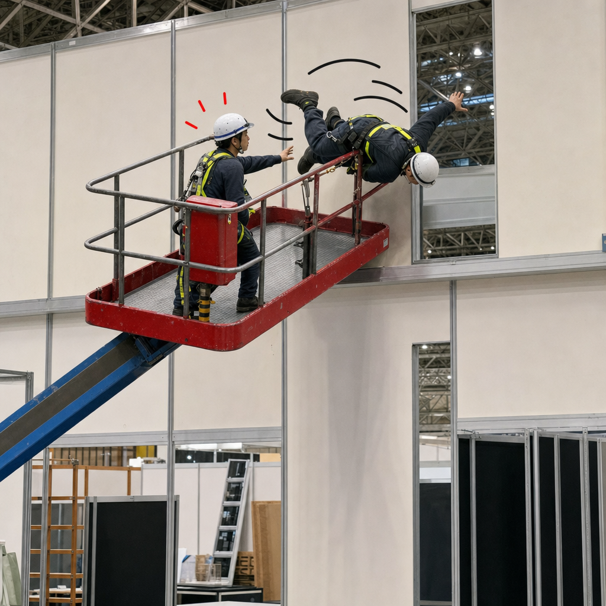
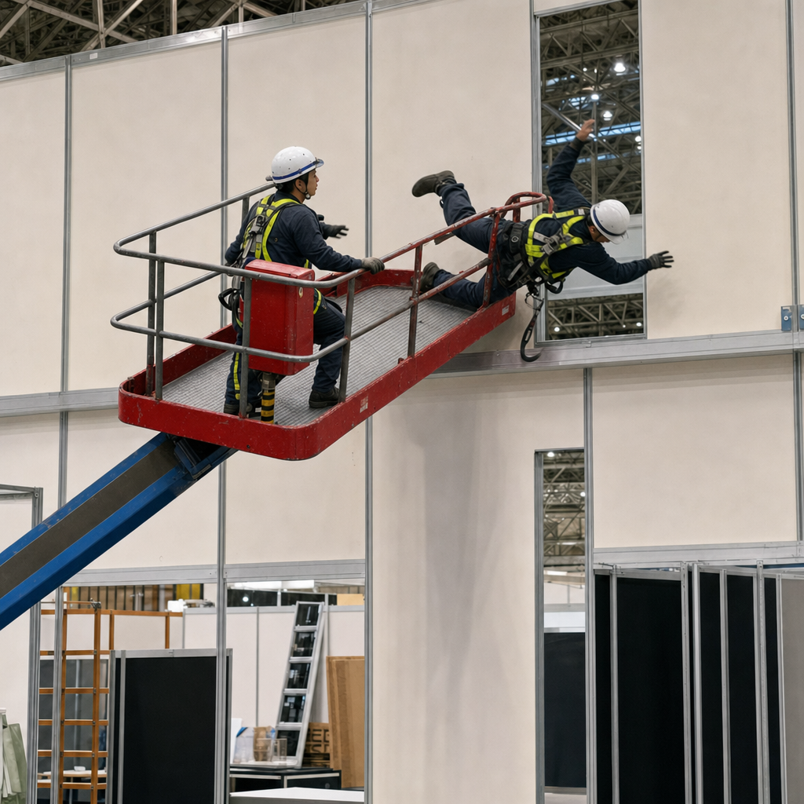
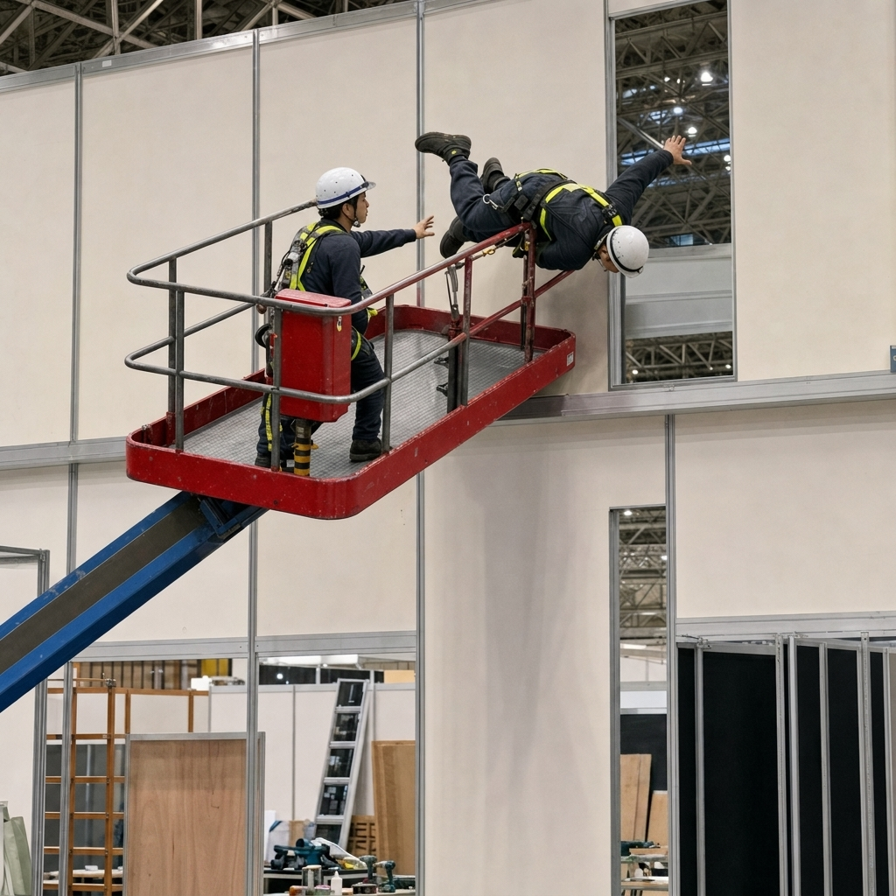

### 前（事故直前） / Phase 1 — Before (lead-up)

**OpenAI Sora 2**

- 【Sora 2／日本語】この画像を開始フレームとして動かす（image-to-video）。ドキュメンタリー調・自然光・手持ちカメラのリアルな実写映像。場面：前（事故直前）。会場の外周・ファサードの作業を、高所作業車の作業床から行っている。作業員は通常どおり準備・作業を進めており、まだ異常は起きていない平穏な場面。 舞台は日本の展示会・イベント設営会場、登場人物は日本人作業員、高所作業車（ブーム式／シザー式・作業床付き）を使用。服装・保護具はあごひも付きヘルメット・ハイビズ（高視認性ベスト）・安全靴・フルハーネス型安全帯。実在ロゴや可読文字は映さない。これは安全教育用の事故再現映像であり、流血・残虐・苦痛の誇張は描かない。約8秒・16:9。
- [Sora 2 / English] Use the provided image as the starting keyframe (image-to-video). Photorealistic documentary footage, natural light, handheld camera. Scene: Phase 1 — Before (lead-up). facade/perimeter work at a venue using an aerial work platform; workers proceed with the build-up task normally — a calm moment, no incident yet. Set at a Japanese exhibition / event build-up venue with Japanese workers using a Japanese aerial work platform / MEWP (boom or scissor lift with a work basket). Workers wear hard hat with chin strap, hi-vis vest, safety boots, full-body safety harness. No real logos or readable text. This is a safety-education re-enactment; no blood, gore or exaggerated suffering. About 8 seconds, 16:9.

**Google Veo 3.1**

- 【Veo 3.1／日本語】開始キーフレーム＝この画像（image-to-video）。被写体：あごひも付きヘルメット・ハイビズ（高視認性ベスト）・安全靴・フルハーネス型安全帯を着けた日本人作業員と高所作業車（ブーム式／シザー式・作業床付き）。場面：前（事故直前）。アクション：会場の外周・ファサードの作業を、高所作業車の作業床から行っている。作業員は通常どおり準備・作業を進めており、まだ異常は起きていない平穏な場面。 カメラ：ゆっくりとした寄り（緩やかなプッシュイン）／手持ちの微振動。ライティング：会場内の自然な照明。スタイル：リアルなドキュメンタリー写真調、実在ロゴ・可読文字なし。安全教育用の再現であり流血・残虐表現は含めない。約8秒・16:9。
- [Veo 3.1 / English] First keyframe = the provided image (image-to-video). Subject: Japanese workers in hard hat with chin strap, hi-vis vest, safety boots, full-body safety harness with a Japanese aerial work platform / MEWP (boom or scissor lift with a work basket). Scene: Phase 1 — Before (lead-up). Action: facade/perimeter work at a venue using an aerial work platform; workers proceed with the build-up task normally — a calm moment, no incident yet. Camera: slow push-in with slight handheld motion. Lighting: natural indoor venue light. Style: realistic documentary photography, no real logos or readable text. A safety-education re-enactment with no blood or gore. About 8 seconds, 16:9.

### 事故の瞬間 / Phase 2 — The moment

**OpenAI Sora 2**

- 【Sora 2／日本語】この画像を開始フレームとして動かす（image-to-video）。ドキュメンタリー調・自然光・手持ちカメラのリアルな実写映像。場面：事故の瞬間。作業床が壁面に接触し、確認のため作業床から身を乗り出した作業者がバランスを崩し、高所から墜落する瞬間。危険の一瞬を捉える（流血・残虐表現なし）。 舞台は日本の展示会・イベント設営会場、登場人物は日本人作業員、高所作業車（ブーム式／シザー式・作業床付き）を使用。服装・保護具はあごひも付きヘルメット・ハイビズ（高視認性ベスト）・安全靴・フルハーネス型安全帯。実在ロゴや可読文字は映さない。これは安全教育用の事故再現映像であり、流血・残虐・苦痛の誇張は描かない。約8秒・16:9。
- [Sora 2 / English] Use the provided image as the starting keyframe (image-to-video). Photorealistic documentary footage, natural light, handheld camera. Scene: Phase 2 — The moment. the work floor contacts a facade and the worker climbs out to check, loses balance and falls from height — capture the dangerous instant (no blood, no gore). Set at a Japanese exhibition / event build-up venue with Japanese workers using a Japanese aerial work platform / MEWP (boom or scissor lift with a work basket). Workers wear hard hat with chin strap, hi-vis vest, safety boots, full-body safety harness. No real logos or readable text. This is a safety-education re-enactment; no blood, gore or exaggerated suffering. About 8 seconds, 16:9.

**Google Veo 3.1**

- 【Veo 3.1／日本語】開始キーフレーム＝この画像（image-to-video）。被写体：あごひも付きヘルメット・ハイビズ（高視認性ベスト）・安全靴・フルハーネス型安全帯を着けた日本人作業員と高所作業車（ブーム式／シザー式・作業床付き）。場面：事故の瞬間。アクション：作業床が壁面に接触し、確認のため作業床から身を乗り出した作業者がバランスを崩し、高所から墜落する瞬間。危険の一瞬を捉える（流血・残虐表現なし）。 カメラ：ゆっくりとした寄り（緩やかなプッシュイン）／手持ちの微振動。ライティング：会場内の自然な照明。スタイル：リアルなドキュメンタリー写真調、実在ロゴ・可読文字なし。安全教育用の再現であり流血・残虐表現は含めない。約8秒・16:9。
- [Veo 3.1 / English] First keyframe = the provided image (image-to-video). Subject: Japanese workers in hard hat with chin strap, hi-vis vest, safety boots, full-body safety harness with a Japanese aerial work platform / MEWP (boom or scissor lift with a work basket). Scene: Phase 2 — The moment. Action: the work floor contacts a facade and the worker climbs out to check, loses balance and falls from height — capture the dangerous instant (no blood, no gore). Camera: slow push-in with slight handheld motion. Lighting: natural indoor venue light. Style: realistic documentary photography, no real logos or readable text. A safety-education re-enactment with no blood or gore. About 8 seconds, 16:9.

### 後（直後の対応） / Phase 3 — After (response)

**OpenAI Sora 2**

- 【Sora 2／日本語】この画像を開始フレームとして動かす（image-to-video）。ドキュメンタリー調・自然光・手持ちカメラのリアルな実写映像。場面：後（直後の対応）。直ちに作業を中断し、周囲の作業員が駆け寄って安全を確認する。大きな外傷描写はなく、再発防止を促す静かな余韻で終える。 舞台は日本の展示会・イベント設営会場、登場人物は日本人作業員、高所作業車（ブーム式／シザー式・作業床付き）を使用。服装・保護具はあごひも付きヘルメット・ハイビズ（高視認性ベスト）・安全靴・フルハーネス型安全帯。実在ロゴや可読文字は映さない。これは安全教育用の事故再現映像であり、流血・残虐・苦痛の誇張は描かない。約8秒・16:9。
- [Sora 2 / English] Use the provided image as the starting keyframe (image-to-video). Photorealistic documentary footage, natural light, handheld camera. Scene: Phase 3 — After (response). work stops immediately; nearby workers rush in and check on safety. No graphic injury; end on a quiet beat that stresses prevention. Set at a Japanese exhibition / event build-up venue with Japanese workers using a Japanese aerial work platform / MEWP (boom or scissor lift with a work basket). Workers wear hard hat with chin strap, hi-vis vest, safety boots, full-body safety harness. No real logos or readable text. This is a safety-education re-enactment; no blood, gore or exaggerated suffering. About 8 seconds, 16:9.

**Google Veo 3.1**

- 【Veo 3.1／日本語】開始キーフレーム＝この画像（image-to-video）。被写体：あごひも付きヘルメット・ハイビズ（高視認性ベスト）・安全靴・フルハーネス型安全帯を着けた日本人作業員と高所作業車（ブーム式／シザー式・作業床付き）。場面：後（直後の対応）。アクション：直ちに作業を中断し、周囲の作業員が駆け寄って安全を確認する。大きな外傷描写はなく、再発防止を促す静かな余韻で終える。 カメラ：ゆっくりとした寄り（緩やかなプッシュイン）／手持ちの微振動。ライティング：会場内の自然な照明。スタイル：リアルなドキュメンタリー写真調、実在ロゴ・可読文字なし。安全教育用の再現であり流血・残虐表現は含めない。約8秒・16:9。
- [Veo 3.1 / English] First keyframe = the provided image (image-to-video). Subject: Japanese workers in hard hat with chin strap, hi-vis vest, safety boots, full-body safety harness with a Japanese aerial work platform / MEWP (boom or scissor lift with a work basket). Scene: Phase 3 — After (response). Action: work stops immediately; nearby workers rush in and check on safety. No graphic injury; end on a quiet beat that stresses prevention. Camera: slow push-in with slight handheld motion. Lighting: natural indoor venue light. Style: realistic documentary photography, no real logos or readable text. A safety-education re-enactment with no blood or gore. About 8 seconds, 16:9.

---

## 事故事例 N15　低い梁下を移動中、下がり壁と手すりの間に挟まれ

- カテゴリ：高所（高所作業車（ブーム式／シザー式・作業床付き））
- 開始フレーム画像：`photos_v16/N15/base.png` ／ `openai.png` ／ `google.png`（3案いずれかを開始/キーフレームに使用）
- 監修：金田 義太（労働安全コンサルタント 登録第4840号）

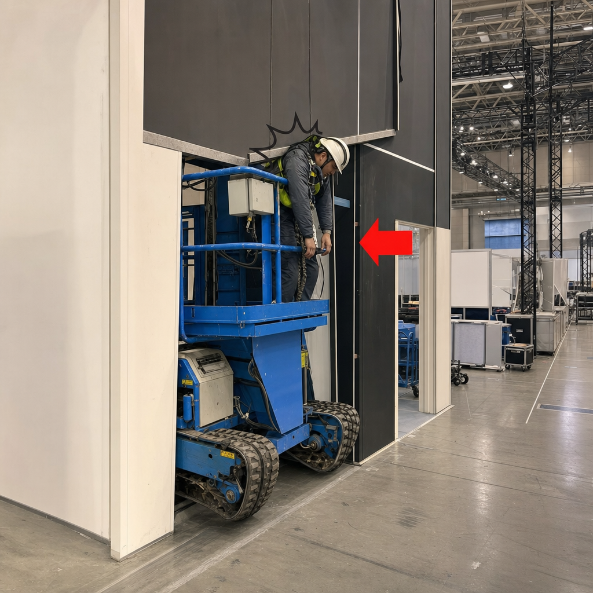
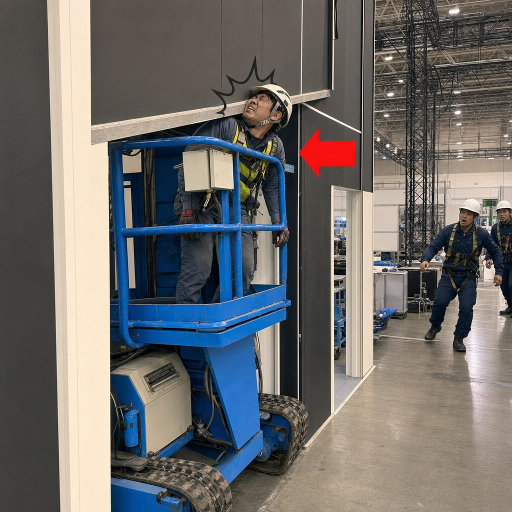
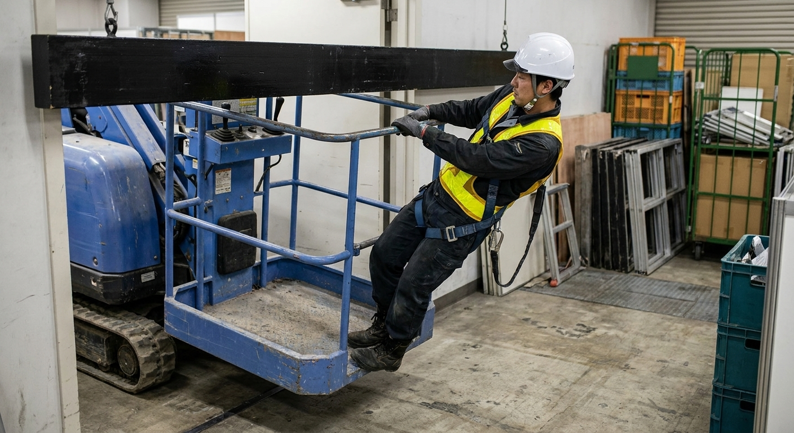

### 前（事故直前） / Phase 1 — Before (lead-up)

**OpenAI Sora 2**

- 【Sora 2／日本語】この画像を開始フレームとして動かす（image-to-video）。ドキュメンタリー調・自然光・手持ちカメラのリアルな実写映像。場面：前（事故直前）。会場の地下・搬入路の低い開口部を、高所作業車で通過しようとしている。作業員は通常どおり準備・作業を進めており、まだ異常は起きていない平穏な場面。 舞台は日本の展示会・イベント設営会場、登場人物は日本人作業員、高所作業車（ブーム式／シザー式・作業床付き）を使用。服装・保護具はあごひも付きヘルメット・ハイビズ（高視認性ベスト）・安全靴・フルハーネス型安全帯。実在ロゴや可読文字は映さない。これは安全教育用の事故再現映像であり、流血・残虐・苦痛の誇張は描かない。約8秒・16:9。
- [Sora 2 / English] Use the provided image as the starting keyframe (image-to-video). Photorealistic documentary footage, natural light, handheld camera. Scene: Phase 1 — Before (lead-up). moving an aerial work platform under a low hanging beam in a venue basement/back area; workers proceed with the build-up task normally — a calm moment, no incident yet. Set at a Japanese exhibition / event build-up venue with Japanese workers using a Japanese aerial work platform / MEWP (boom or scissor lift with a work basket). Workers wear hard hat with chin strap, hi-vis vest, safety boots, full-body safety harness. No real logos or readable text. This is a safety-education re-enactment; no blood, gore or exaggerated suffering. About 8 seconds, 16:9.

**Google Veo 3.1**

- 【Veo 3.1／日本語】開始キーフレーム＝この画像（image-to-video）。被写体：あごひも付きヘルメット・ハイビズ（高視認性ベスト）・安全靴・フルハーネス型安全帯を着けた日本人作業員と高所作業車（ブーム式／シザー式・作業床付き）。場面：前（事故直前）。アクション：会場の地下・搬入路の低い開口部を、高所作業車で通過しようとしている。作業員は通常どおり準備・作業を進めており、まだ異常は起きていない平穏な場面。 カメラ：ゆっくりとした寄り（緩やかなプッシュイン）／手持ちの微振動。ライティング：会場内の自然な照明。スタイル：リアルなドキュメンタリー写真調、実在ロゴ・可読文字なし。安全教育用の再現であり流血・残虐表現は含めない。約8秒・16:9。
- [Veo 3.1 / English] First keyframe = the provided image (image-to-video). Subject: Japanese workers in hard hat with chin strap, hi-vis vest, safety boots, full-body safety harness with a Japanese aerial work platform / MEWP (boom or scissor lift with a work basket). Scene: Phase 1 — Before (lead-up). Action: moving an aerial work platform under a low hanging beam in a venue basement/back area; workers proceed with the build-up task normally — a calm moment, no incident yet. Camera: slow push-in with slight handheld motion. Lighting: natural indoor venue light. Style: realistic documentary photography, no real logos or readable text. A safety-education re-enactment with no blood or gore. About 8 seconds, 16:9.

### 事故の瞬間 / Phase 2 — The moment

**OpenAI Sora 2**

- 【Sora 2／日本語】この画像を開始フレームとして動かす（image-to-video）。ドキュメンタリー調・自然光・手持ちカメラのリアルな実写映像。場面：事故の瞬間。低い下がり壁・梁と作業床の手すりの間に、作業者の身体が挟まれそうになる瞬間。危険の一瞬を捉える（流血・残虐表現なし）。 舞台は日本の展示会・イベント設営会場、登場人物は日本人作業員、高所作業車（ブーム式／シザー式・作業床付き）を使用。服装・保護具はあごひも付きヘルメット・ハイビズ（高視認性ベスト）・安全靴・フルハーネス型安全帯。実在ロゴや可読文字は映さない。これは安全教育用の事故再現映像であり、流血・残虐・苦痛の誇張は描かない。約8秒・16:9。
- [Sora 2 / English] Use the provided image as the starting keyframe (image-to-video). Photorealistic documentary footage, natural light, handheld camera. Scene: Phase 2 — The moment. driving through a low opening, the worker is pinched between a hanging wall/low beam and the platform handrail — capture the dangerous instant (no blood, no gore). Set at a Japanese exhibition / event build-up venue with Japanese workers using a Japanese aerial work platform / MEWP (boom or scissor lift with a work basket). Workers wear hard hat with chin strap, hi-vis vest, safety boots, full-body safety harness. No real logos or readable text. This is a safety-education re-enactment; no blood, gore or exaggerated suffering. About 8 seconds, 16:9.

**Google Veo 3.1**

- 【Veo 3.1／日本語】開始キーフレーム＝この画像（image-to-video）。被写体：あごひも付きヘルメット・ハイビズ（高視認性ベスト）・安全靴・フルハーネス型安全帯を着けた日本人作業員と高所作業車（ブーム式／シザー式・作業床付き）。場面：事故の瞬間。アクション：低い下がり壁・梁と作業床の手すりの間に、作業者の身体が挟まれそうになる瞬間。危険の一瞬を捉える（流血・残虐表現なし）。 カメラ：ゆっくりとした寄り（緩やかなプッシュイン）／手持ちの微振動。ライティング：会場内の自然な照明。スタイル：リアルなドキュメンタリー写真調、実在ロゴ・可読文字なし。安全教育用の再現であり流血・残虐表現は含めない。約8秒・16:9。
- [Veo 3.1 / English] First keyframe = the provided image (image-to-video). Subject: Japanese workers in hard hat with chin strap, hi-vis vest, safety boots, full-body safety harness with a Japanese aerial work platform / MEWP (boom or scissor lift with a work basket). Scene: Phase 2 — The moment. Action: driving through a low opening, the worker is pinched between a hanging wall/low beam and the platform handrail — capture the dangerous instant (no blood, no gore). Camera: slow push-in with slight handheld motion. Lighting: natural indoor venue light. Style: realistic documentary photography, no real logos or readable text. A safety-education re-enactment with no blood or gore. About 8 seconds, 16:9.

### 後（直後の対応） / Phase 3 — After (response)

**OpenAI Sora 2**

- 【Sora 2／日本語】この画像を開始フレームとして動かす（image-to-video）。ドキュメンタリー調・自然光・手持ちカメラのリアルな実写映像。場面：後（直後の対応）。直ちに作業を中断し、周囲の作業員が駆け寄って安全を確認する。大きな外傷描写はなく、再発防止を促す静かな余韻で終える。 舞台は日本の展示会・イベント設営会場、登場人物は日本人作業員、高所作業車（ブーム式／シザー式・作業床付き）を使用。服装・保護具はあごひも付きヘルメット・ハイビズ（高視認性ベスト）・安全靴・フルハーネス型安全帯。実在ロゴや可読文字は映さない。これは安全教育用の事故再現映像であり、流血・残虐・苦痛の誇張は描かない。約8秒・16:9。
- [Sora 2 / English] Use the provided image as the starting keyframe (image-to-video). Photorealistic documentary footage, natural light, handheld camera. Scene: Phase 3 — After (response). work stops immediately; nearby workers rush in and check on safety. No graphic injury; end on a quiet beat that stresses prevention. Set at a Japanese exhibition / event build-up venue with Japanese workers using a Japanese aerial work platform / MEWP (boom or scissor lift with a work basket). Workers wear hard hat with chin strap, hi-vis vest, safety boots, full-body safety harness. No real logos or readable text. This is a safety-education re-enactment; no blood, gore or exaggerated suffering. About 8 seconds, 16:9.

**Google Veo 3.1**

- 【Veo 3.1／日本語】開始キーフレーム＝この画像（image-to-video）。被写体：あごひも付きヘルメット・ハイビズ（高視認性ベスト）・安全靴・フルハーネス型安全帯を着けた日本人作業員と高所作業車（ブーム式／シザー式・作業床付き）。場面：後（直後の対応）。アクション：直ちに作業を中断し、周囲の作業員が駆け寄って安全を確認する。大きな外傷描写はなく、再発防止を促す静かな余韻で終える。 カメラ：ゆっくりとした寄り（緩やかなプッシュイン）／手持ちの微振動。ライティング：会場内の自然な照明。スタイル：リアルなドキュメンタリー写真調、実在ロゴ・可読文字なし。安全教育用の再現であり流血・残虐表現は含めない。約8秒・16:9。
- [Veo 3.1 / English] First keyframe = the provided image (image-to-video). Subject: Japanese workers in hard hat with chin strap, hi-vis vest, safety boots, full-body safety harness with a Japanese aerial work platform / MEWP (boom or scissor lift with a work basket). Scene: Phase 3 — After (response). Action: work stops immediately; nearby workers rush in and check on safety. No graphic injury; end on a quiet beat that stresses prevention. Camera: slow push-in with slight handheld motion. Lighting: natural indoor venue light. Style: realistic documentary photography, no real logos or readable text. A safety-education re-enactment with no blood or gore. About 8 seconds, 16:9.

---

合計：15事例 × 3フェーズ × （Sora 2 + Veo 3.1）× 日英 = 180 プロンプト。
